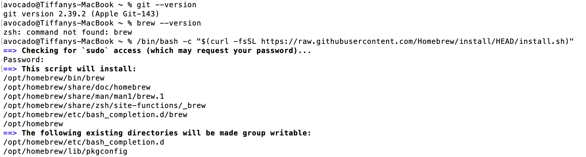
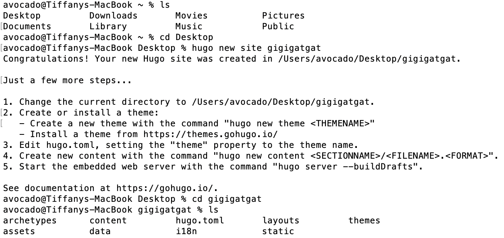
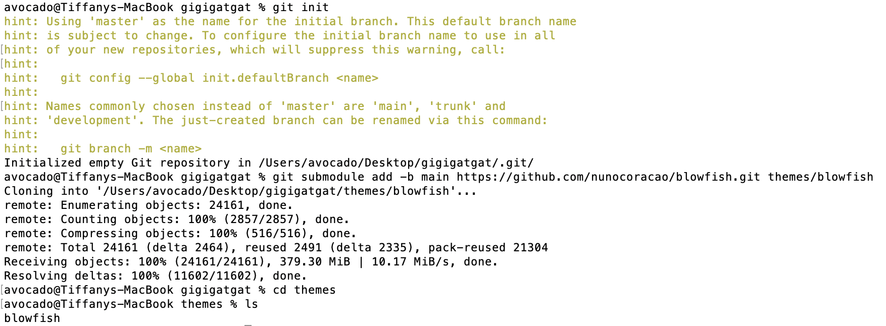
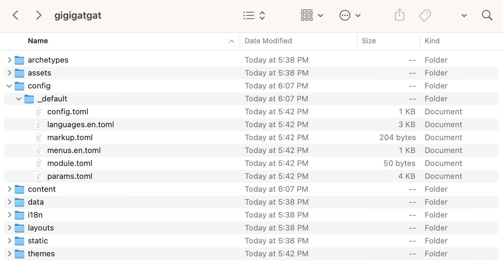
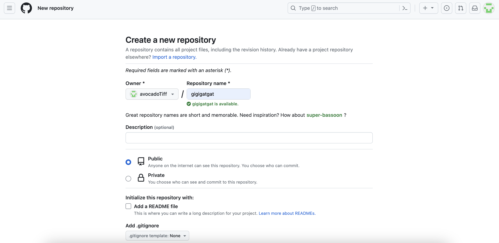
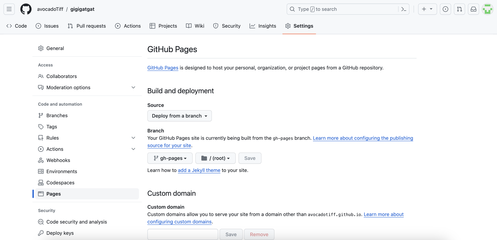


Everyone deserves to own a blog. I'm here to help.

There are numerous ways to build a blog. You can choose popular platforms like WordPress, Medium, or Notion for simplicity, or craft static web pages using frameworks like Hugo and Hexo if you're comfortable with a touch of coding. My personal preference leans toward the latter because it offers greater customization, cost-effectiveness, and stability. If you're curious about selecting the right blogging tool for you, you can also check out this [Chinese blog](https://blog.douchi.space/choose-blog-tool/) written by [Douchi](https://blog.douchi.space/) for valuable insights.

**This article is written for people who are interested in creating a blog on their own but have minimal coding experience.** It focuses on using **Hugo** and **GitHub** as the main tools for creating a blog. Hugo offers hundreds of [themes](https://themes.gohugo.io/) with diverse styles and functions that you can explore to suit your personal needs. I would recommend the [Blowfish theme](https://themes.gohugo.io/themes/blowfish/), which is one of the most advanced and flexible themes in Hugo with attractive layout and detailed documentation. _If you prefer to use a different theme, simply refer to the documentation of your chosen theme when it comes to theme-specific steps._
## Prerequisites 
**No prior background knowledge is needed.** I will try to explain everything in the procedures and feel free to leave a comment if you have any questions during the setup.

However, to ensure a smooth follow-along experience, please complete the following steps before getting started:
- Sign up for a [GitHub](https://github.com/) Account and generate a personal access token following this [tutorial](https://cst8209.github.io/modules/git/git-basics/remote.html#preparing-git-to-work-with-github)

Copy the token and store it somewhere else, because you won't be able to see it again on GitHub.

- Download a code editor if you don't have one
	- [Visual Studio Code](https://code.visualstudio.com/Download), recommended for individuals with long-term coding needs
	- [Sublime Text](https://www.sublimetext.com/download), recommended for beginners
- Install [Git](https://git-scm.com/downloads) on your system
	- You can check whether Git is already installed by running `git --version` in the terminal
	- If you're a Mac user, please install [homebrew](https://brew.sh/) first, which will make your life much easier



For coding newbies, the installation steps are essentially copying and pasting commands into the terminal. You can find the macOS Terminal in the Utilities folder within the Applications folder, or simply search for it using Spotlight; Windows user please use PowerShell.

That's it! You're ready to start now.
## Procedures
### 1. Install Hugo
**for MacOS**
- Run this command in the terminal. This will install the extended edition of Hugo.
``` shell
brew install hugo
```
- Enter this command in the terminal to verify whether Hugo is installed successfully.
```shell
hugo version
```
**for Windows**
- Refer to [Hugo Installation Instructions](https://gohugo.io/installation/windows/) or this [tutorial on Windows 10](https://www.techielass.com/how-to-install-hugo-on-windows-10/)
### 2. Create a Hugo Site

For Windows users, please only use **PowerShell** for the following commands as required by Hugo. _Do not use the Command Prompt or Windows PowerShell._ PowerShell and Windows PowerShell [are different applications](https://learn.microsoft.com/en-us/powershell/scripting/whats-new/differences-from-windows-powershell?view=powershell-7.3).

- Run the `cd` command to navigate to the folder where you'd like to store the code for the blog. For example, if you want to place the folder on your `Desktop`, the command should be:
``` shell
cd ~/Desktop
```

> `cd` means "change directory", which will allow the terminal to change its current working directory to another location in the file system. `~` refers to the home directory on your system. It can be omitted if you're already in the home directory.

If you want to place your folder in a different location, you will need to modify the code with the actual path. Learn more about the command line [here](https://developer.mozilla.org/en-US/docs/Learn/Tools_and_testing/Understanding_client-side_tools/Command_line#welcome_to_the_terminal) for your reference.

- Run this command with **your own site name** to create the necessary directory structure for your website. For example, the exact command I used is `hugo new site gigigatgat`.
``` shell
hugo new site <your-site-name>
```

- You should see a folder with the name `<your-site-name>` on your desktop or your selected location. The folder should include eight subfolders and one configuration file:
```
├─ archetypes
├─ assets
├─ content
├─ data
├─ hugo.toml
├─ i18n
├─ layouts
├─ static
├─ themes
```

The names and quantities of folders may differ depending on the Hugo version. Don't stress too much about that.



> `ls` means "list", which will display the contents of a directory.
### 3. Download and Configure the Blowfish Theme

If you'd like to use another theme, please refer to the specific theme's documentation and then proceed to [Step5: Preview and Publish](#5-preview-and-publish).

#### Download the Blowfish theme
- Run the following commands one by one. **Make sure you replace `<your-site-name>` with the actual folder name.**
``` shell
cd <your-site-name>
git init
git submodule add -b main https://github.com/nunocoracao/blowfish.git themes/blowfish
```
- Check the `themes` folder in this project. The Blowfish theme should be cloned in this folder.


#### Set up the basic configuration files
- In the root folder of your website project, delete the initial `hugo.toml` file.
- Copy all the config files from the `themes/blowfish/config/_default/` folder to the `config/_default/` folder in your root folder. 
- After the previous steps, your folder should look as follows:


The **official installation, configuration, and updates guide** could be found [here](https://blowfish.page/docs/installation/#download-the-blowfish-theme). Please note that some file names are different because of the version of Hugo. If you're using Hugo Version 0.119.0 or later, my instructions are the most up-to-date.
### 4. Dive into the Blowfish Theme
I strongly recommend that you go through the official [Blowfish Documentation Series](https://blowfish.page/docs/) to develop a comprehensive understanding towards the various parameters of the files and functionalities of the theme. This section serves as **a quick start for a basic blog** and provides some additional explanations based on the documentation.

In the theme files, you'll see the  `#` character frequently which is used to denote comments. Removing the `#` character will activate the line of code.
#### Modify the configuration files
##### **# config.toml**
Set the parameters as below and note that:
- Update the baseURL as `https://<github_username>.github.io/<repository-name>`. You'll set up the repository in GitHub later. My baseURL in this case is `https://avocadoTiff.github.io/gigigatgat`.
- You may want to change the `defaultContentLanguage` to "zh-CN" for simplified Chinese or "zh-tw" for traditional Chinese. Other available languages could be found [here](https://blowfish.page/docs/configuration/#language-and-i18n).
``` shell
# config/_default/config.toml

theme = "blowfish"
baseURL = "https://<github_username>.github.io/<repository-name>"
defaultContentLanguage = "en"
```
##### **# languages.en.toml**
If your website language is English, you can just modify the following parts of the file:
``` shell
# config/_default/languages.en.toml
title = "<your-site-name>"

[author]
name = "your name"
image = "img/blowfish_logo.png"
headline = "I'm only human" 
bio = "A little bit about me"
links = [
  { email = "mailto:hello@your_domain.com" },
  { instagram = "https://instagram.com/username" },
  { mastodon = "https://mastodon.instance/@username" }
]
```

If the `defaultContentLanguage` you set in the `config.toml` file is "zh-CN", you should rename this file as `languages.zh-CN.toml` and update the code as below:
``` shell
# config/_default/languages.zh-CN.toml

languageCode = "zh-CN"
languageName = "Chinese"
weight = 1
title = "<your-site-name>"

[params]
  displayName = "中文"
  isoCode = "zh-CN"
  rtl = false
  dateFormat = "2 January 2006"
  # logo = "img/logo.png"

[author]
name = "Your name"
image = "img/blowfish_logo.png"
headline = "I'm only human"
bio = "A little bit about me"
links = [
  { email = "mailto:hello@your_domain.com" },
  { instagram = "https://instagram.com/username" },
  { mastodon = "https://mastodon.instance/@username" }
]
```
- The images should be placed in the site’s `assets/img/` folder.
- In the `[params]` section
	- `displayName` will only be displayed when the language switch function is used
	- `logo` represents the site's logo
- In the `[author]` section
	- `image` is your profile image
	- `headline` will be displayed on the homepage
	- `bio` will be displayed in the articles if you set `showAuthor = true` in the `params.toml`
	- `links` are the social media icons with links that you'd like to share


For `links`, the correct syntax is: `links = [{item1}, {item2}, {item3}]`. Avoid omitting any punctuation or adding an extra comma after the last item.
<br>
##### **# menus.en.toml**
Refer to the code below for basic menu settings:
``` shell
# config/_default/menus.en.toml

 [[main]]
  name = "Posts"
  pageRef = "posts"
  weight = 10

[[main]]
  name = "Tech"
  parent = "Posts"
  pageRef = "categories/tech"
  weight = 20

[[main]]
  name = "Kitchen"
  parent = "Posts"
  pageRef = "categories/kitchen"
  weight = 30

[[main]]
  name = "About"
  pageRef = "about"
  weight = 70

[[main]]
  identifier = "github"
  pre = "github"
  url = "your-url-link"
  weight = 100

 [[footer]]
   name = "Tags"
   pageRef = "tags"
   weight = 10

 [[footer]]
   name = "Categories"
   pageRef = "categories"
   weight = 20
```
- `name` specifies the text will be displayed in the menu link.
- `pageRef` specifies where the Hugo page would be directed to. You need to have corresponding pages in the `content` folder to be linked to.
- `parent` is used for nested menus.
- `identifier` and `pre` are used to place [icons](https://blowfish.page/samples/icons/) in the menu.
- `url` is for linking to external URLs.
- `weight` is used to sort the menu links in ascending order. The lowest weight will be displayed as the first item in the menu.

Similar with above, rename the file as `menus.zh-CN.toml` if simplified Chinese is your site's `defaultContentLanguage`.
##### **# params.toml**
This file specifies a wide range of theme parameters that you can use to customize your site. To ensure a smooth start, I suggest you modify the following lines in the file:
``` shell
# config/_default/params.toml

mainSections = ["posts"]
disableImageOptimization = false

defaultBackgroundImage = "/img/ocean.jpg"
defaultFeaturedImage = "/img/ocean.jpg"

highlightCurrentMenuArea = true
smartTOC = true
smartTOCHideUnfocusedChildren = false

[header]
  layout = "fixed" # valid options: basic, fixed, fixed-fill, fixed-fill-blur

[homepage]
  layout = "background" # valid options: page, profile, hero, card, background, custom
  # homepageImage = "/img/ocean.jpg" # used in: hero, and card
  showRecent = true
  showRecentItems = 10
  showMoreLink = false
  showMoreLinkDest = "posts"
  cardView = false
  cardViewScreenWidth = false
  layoutBackgroundBlur = true # only used when layout equals background

[article]
  showTableOfContents = true
  showTaxonomies = true
```

- Again, the images should be placed in the site’s `assets/img/` folder. For now you can copy all the files from the `themes/blowfish/exampleSite/assets/` folder to the `assets` folder in your root folder for convenience.
- `mainSections` is related to the content you'd like to display in the `Recent` articles on the homepage.
- Refer to the [Blowfish Configuration](https://blowfish.page/docs/configuration/#theme-parameters) article for more details and experiment with the rest parameters later.
#### Add pages to your site
##### **- Content Organization**
All content is placed within the `content` folder. Below is an example of the content structure based on the above menu:
```
.
├── assets
│   └── img
│       └── ocean.jpg
|       └── logo.png
├── config
│   └── _default
├── content
│   ├── _index.md
│   ├── about.md
│   ├── categories
│   │   ├── _index.md
│   │   ├── tech
│   │   │   └── _index.md
│   │   └── kithen
│   │       └── _index.md
│   ├── tags
│   │   └── _index.md
│   └── posts
│       ├── _index.md
│       └── first-post
│           ├── featured.jpg
│           └── index.md
└── themes
    └── blowfish
```
##### **- Add Content**
There are two ways to add content in the site project: you can either use the **GUI (Graphical User Interface)** or the **CLI (Command Line Interface)**.
- **GUI:** Simply create new folders, copy and paste files, edit them in your code editor. The example files can be found at `themes/blowfish/exampleSite/content/` folder. 


Don't copy all of the example files. Simplify the main content to plain text immediately, as the old content may be related to other files and could cause errors.

- **CLI:** Copy `default.md` from `themes/blowfish/exampleSite/archetypes/` folder to replace the initial one in the `archetypes`folder in your root directory. Use the terminal to run this Hugo command to create a new page:
``` shell
hugo new content posts/my-first-post/index.md
```
This command will create an `index.md` file in the `content/posts/my-first-post` folder based on the front matter template defined in the `archetypes` folder. If you open the file in your code editor, it will now look like this:
``` shell
---
title: "Index"
date: 2023-11-02T16:21:18-04:00
draft: true
---
```
##### **- Branch pages**
Branch pages include the [homepage](https://tiffahahahu7.github.io/gigigatgat/), [section listings](https://tiffahahahu7.github.io/gigigatgat/categories/tech/), and [taxonomy pages](https://tiffahahahu7.github.io/gigigatgat/tags/). The filename for this content type is `_index.md`. As you can see in the above content structure, the  `content/_index.md` file defines the content of the homepage, and the `content/posts/_index.md` file defines the content of the `posts` page. In [this example](https://tiffahahahu7.github.io/gigigatgat/posts/), I only specified the title, description, and whether the posts list on this page would be grouped by year:
``` shell
---
title: "Posts"
description: "All posts"
groupByYear: true
---
```
##### **- Leaf pages**
Leaf pages are single pages that don't contain a list of sub-pages. It is named as `index.md` in the corresponding post folder for an individual article page or `about.md` for an about page. My `index.md` file in the `content/posts/Getting Started with Entity Framework Core in Visual Studio` folder looks like this:
``` shell
---
title: "Getting Started with Entity Framework Core in Visual Studio"
date: 2023-10-24
draft: false
description: "How to use Entity Framework Core to connect database in Visual Studio"
slug: "how to use Entity Framework Core"
tags: ["tutorial", "code", "ASP.NET", "VisualStudio"]
categories: ["Tech"]
---

Entity Framework Core is a powerful tool for simplifying database integration with web applications...
```
- `draft` determines whether this content is ready to be published or not. If it is set to `true`, the content will not be visible when you build the site.
- `slug` is used in the URL path when the content is published. In my case, the link for this post would be `https://tiffahahahu7.github.io/gigigatgat/posts/how-to-use-entity-framework-core/`.
- `tags` and `categories` are defined here to be displayed on the `Tags` and `Categories` pages.
- The body of the post is written in **[markdown](https://commonmark.org/help/)**, an easy-to-use text formatting language. **I strongly recommend familiarizing yourself with it.**

For more explanations, you can refer to Blowfish's [Content Examples](https://blowfish.page/docs/content-examples/) and [Front Matter](https://blowfish.page/docs/front-matter/).
### 5. Preview and Publish
- Run this command in the terminal to preview the site in your browser, with the given URL address `http://localhost:1313/` or `http://localhost:1313/<repository-name>` depending on your baseURL.
``` shell
hugo server
```

Make sure that the `draft` value for the pages you want to display is set to `false`; otherwise, they won't appear in the browser, unless you run `hugo server -D`.


_If you site doesn't render your posts correctly, double-check the rules for [content organization](#add-pages-to-your-site)._
- Modify the content and configuration until you're satisfied with the preview. `Tags` and `Categories` may not be updated immediately. In this case, try to exit by pressing `Ctrl + C` and restart `hugo server` to see the changes.
- In the root directory, run the following command to publish the site. It will create a `public` folder with the entire static files necessary for your website.
``` shell
hugo
```
### 6. How to Deploy the Site with GitHub Pages
- Go to your GitHub Account and create a new repository. The repository name should be in accordance with your baseURL in the `config.toml` file.


- Run the following commands to add the GitHub repository as a remote repository and push all the local files to it. **Remember to replace with your own remote URL.**
```
git init
git add .
git commit -m "first commit"
git branch -M main
git remote add origin https://github.com/avocadoTiff/gigigatgat.git
git push -u origin main
```

If you encounter a prompt requiring your GitHub username and password. Enter your **personal access token** as the password instead of your account password.

- Change your directory into `public`. Run the following commands to connect to the remote  repository and create a `gh-pages` branch
```
cd public
git init
git remote add origin https://github.com/avocadoTiff/gigigatgat.git
git checkout --orphan gh-pages
```
- Run the following commands to upload the files to `gh-pages` branch
```
git add .
git commit -m "upload site files"
git push -u origin gh-pages
```
- In the `Settings > Pages`, ensure that the GitHub Pages site is being built from the `gh-pages` branch


- Wait for a few minutes and refresh the page. You'll see a message like this: `Your site is live at https://avocadotiff.github.io/gigigatgat/`. 

**:party_popper: Congrats! Your blog is now live online!**
### 7. How to Update Your Blog
Once you make any modification or add new posts to your blog, you can update your blog by three steps:
- In the root directory, review you site preview by executing the command `hugo server` and then run the command `hugo` to update the site files in the `public` folder.
- Ensure that you're still in the in the root directory and run the following commands:
```
git add .
git commit -m "add new posts"
git push -u origin main
```
- Change your directory into `public` by the command `cd public` and run the following commands:
```
git add .
git commit -m "add new posts"
git push -u origin gh-pages
```

This is the most basic way of updating your blog manually. You can also automate the deployment process with [GitHub Actions](https://gohugo.io/hosting-and-deployment/hosting-on-github/), which is a more advanced and efficient method. I'm still in the process of learning GitHub Actions, and I'll keep you updated if I come across an easier way to comprehend and make use of this tool. <hr>

Thank you for reading this far! I hope this tutorial can help you in building your personal blog smoothly. If you have any questions during the process, please feel free to reach out. I'm more than happy to help create another blog in the universe.

## Reference
- [Hugo Documentation](https://gohugo.io/documentation/)
- [Blowfish Documentation Series](https://blowfish.page/docs/)
- [Create a static website with Hugo and Host it with Github Pages](https://blog.clairvoyantsoft.com/create-a-static-website-with-hugo-and-host-it-with-github-pages-f268b12371)

