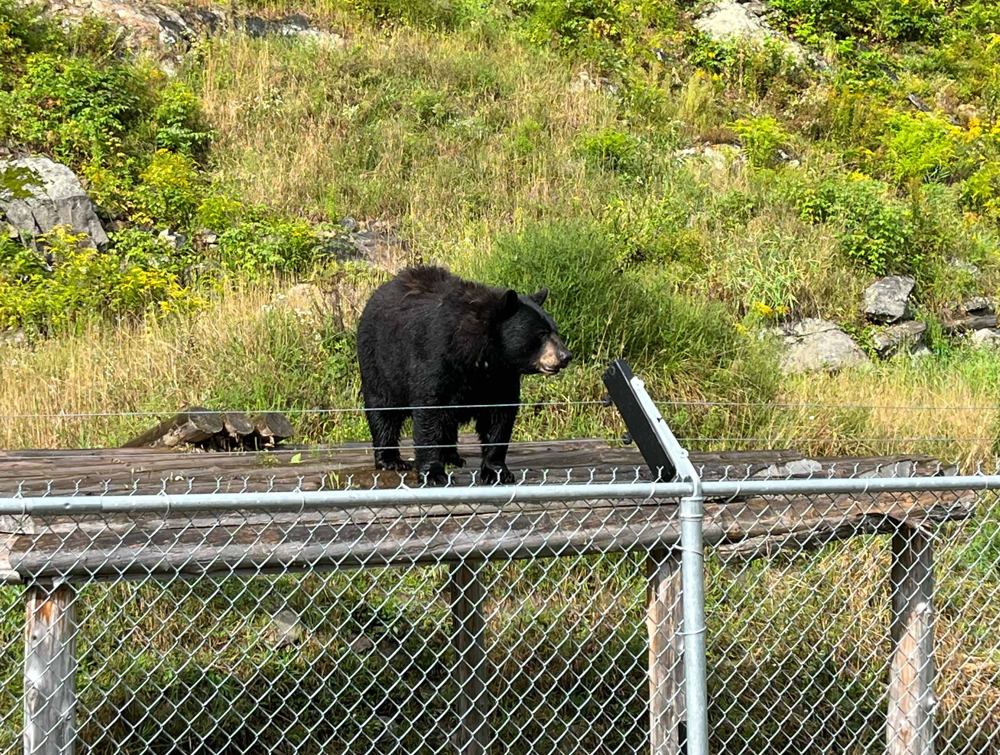
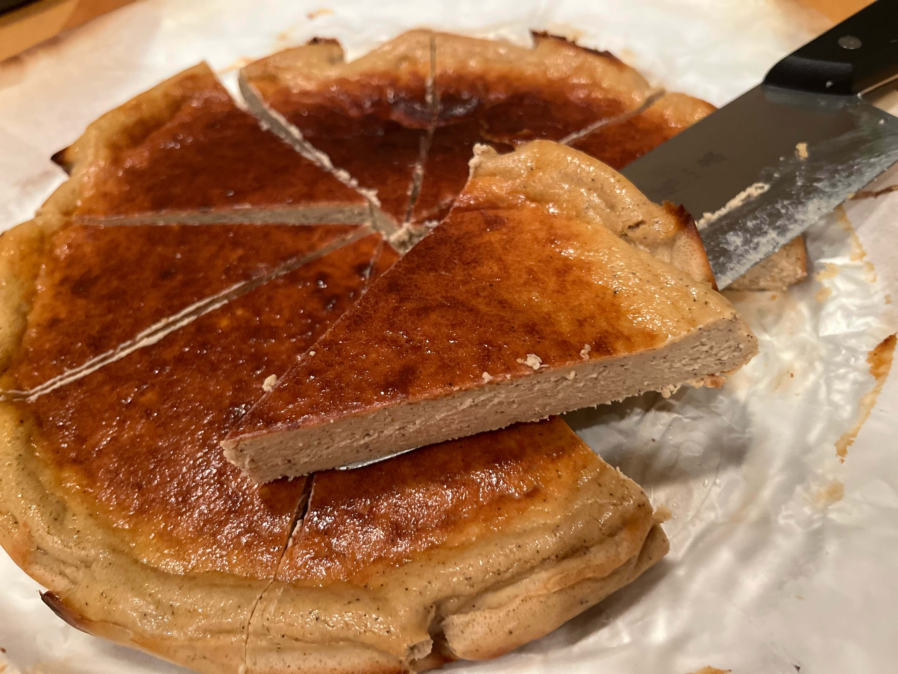

八月的氣溫高高低低，有時最高溫度還是30度，有時又猝不及防地降到15度，穿短袖在室外呆一會兒就被凍得打了好幾個噴嚏，感覺很快就要和夏天說拜拜了。夏天最喜歡的戶外活動是晚飯後拖著Sloth一起在街區散步。有時遇見一隻縱身跳進垃圾桶翻食物的胖胖浣熊，有時遇見一隻松鼠和野貓劍拔弩張地對峙（第一次聽到松鼠叫！是像警報一樣尖銳的聲音），有時遇見一隻哈士奇坐在駕駛座上英武地等主人歸來（車開了寵物模式走在外面也能聽見冷風呼呼地吹），走下走下也沒有要去邊，但走著就會有新發現。

## 本月Milestones
### co-op告一段落
時間真的過得好快，八個月過去突然間又要回學校上課了，已經開始覺得怪不習慣的。我很喜歡我的兩次co-op經歷，第一段co-op的supervisor儼然已經和我成為（忘年）朋友，昨天約了咖啡局不知不覺就聊了兩個小時的天；第二段co-op的工作氛圍更讓我感受到一種近乎cultural shock的包容和支持——我在這裡得到的愛和認可，那些被大聲表達出來的正向反饋，那些跨組跨國跨級別也要到達你面前的誇讚，比我過去二十幾年聽到的都多，都強烈。剛開始我還有一種隱隱的「不配得感」，覺得自己僥倖，覺得身邊任何一個同僚都比我優秀得多，但久而久之我能看到自己小小的自信心，是因為他們一遍又一遍不厭其煩的肯定才逐漸澆灌發芽開枝散葉的。

臨近實習結束，我向老闆感謝他對我的認可和支持，他回覆說，「I'm one of your biggest fans! You earned the praise🙇」。聽著人的心都化了。我完全無法想像類似的話如何在老中職場裡得到表達，老中領導不把員工當成他自己的fans就謝天謝地了。
### 野生動物園之行
我和Sloth都不是愛出門的人。這個月因為有朋自遠方來，難得決定搞一天day trip，目的地是本來也在我的願望清單裡躺了大半年的Omega Park。這是一個自駕safari route形式的野生動物園，剛開進去就有成群的鹿拱到車窗邊來討胡蘿蔔吃，然後一邊開一邊隨機偶遇散落或聚居的大小動物。作為司機我其實沒太多機會拍照，中途休息時我一看Sloth的手機一陣無語——我們看了這麼多動物結果他相冊裡全是旱獺和河狸，明晃晃的對嚙齒目動物的偏愛。好在整合了友人的照片後還是能找到一些值得被留存的瞬間，請看這些漂亮生靈！


  
  
  
  
  
  


## 本月碎碎念
### 消耗椰漿
為了做楊枝甘露買了椰漿，400ml一罐看起來不多，但包裝上寫了開封後三日內用完，消耗起來也很有壓力。我連做了三天兩人份的楊枝甘露（無西米也好喝！），還試了生椰拿鐵（不推薦）和放在咖喱雞裡提升風味（吃不出來），總算是用完了。在reddit上搜了搜相關問答，原來好多人會選擇開封後倒進glass mason jar，在冰箱裡放一星期也能吃。倒進硅膠冰格冷凍也是一種選擇，不過可能就比較適合用來做菜加工而不是自製飲品了。
### 消耗牛奶
4L袋裝牛奶比1L盒裝牛奶只貴一兩塊，我當然選袋裝牛奶了。買完後的痛苦發現是家裡只有我一個人喝牛奶，Sloth只吃加工後的牛奶製品（⋯⋯），於是我開始和牛奶保質期賽跑。咣咣喝拿鐵和酒釀冰奶之外，鄰近保質期的那幾天我每天都在換著花樣做雙皮奶、椰奶小方、炸鮮奶⋯⋯消耗完後到今天已經十幾天沒買牛奶了，覺得心境很祥和。
### 消耗淡奶油
故事要從有一天在costco拿了一盒1L裝的淡奶油說起⋯⋯好消息是這次做出的伯爵紅茶巴斯克表皮很漂亮，壞消息是雖然double用量因為模具偏大成品還是扁扁的(ಥ﹏ಥ)。還做了無數次奶蓋和雙皮奶，沒有想過自己有一天也會sick of奶蓋，但加了淡奶油的雙皮奶我可以吃無數次，奶味醇厚真的好加分。

### 消耗淡奶
覺得這個碎碎念系列整整齊齊的有點好笑，索性把淡奶也加進去，畢竟這個月剛好用完了（若干個月以前）冷凍的一袋淡奶。淡奶目前在我眼裡只有兩種做法，要麼做港式奶茶，要麼做[譚仔米線](https://www.gigigatgat.ca/posts/tamjai-samgor-rice-noodle/)湯底配料，我們家更常做後者。歡迎推薦其他用法！我翹首以盼！
## 博客更新
### 已發布
-  [Twikoo評論系統的個性化設置](https://www.gigigatgat.ca/posts/twikoo-tutorial/)：一篇因為拖延做其他「正經事」而激發行動力的快打教程，主要分享了評論區怎麼自定義頭像和表情包。因為有時候會突然想要其他友鄰評論區的自定義表情包，**我靈光一現開了一個[github repo](https://github.com/avocadoTiff/twikoo)，有興趣的朋友可以在這裡一起同步自己的`owo.json`文件供他人參考**，假以時日說不定能整理出一個比[Twikoo-Magic](https://github.com/2X-ercha/Twikoo-Magic)更符合我們審美的表情包倉庫。
- [🔮 神奇週會的一百種樣子](https://www.gigigatgat.ca/posts/mojo-meeting/)：在co-op期間遇到的最喜歡的週會形式，有很多好玩的有創意的小活動。我之後還了解到原來這些mojo activity他們每年每個人只會主持一次，這樣也避免了一些「必須在一段時間內想出一個活動」的壓力，真好！
### 裝修筆記
- **配置umami**：一開始本博客的默認數據統計工具也是google analytics，雖然一早看過Kyo[《零成本、不需自建搭建Umami：开源易用的网站访问量统计工具》](https://thirdshire.com/running-umami-on-planetscale-vercel/)這篇文章，但因為內心隱隱抗拒多平台註冊帳戶的前提條件遲遲沒有行動（我是那種很討厭註冊沒必要的新帳戶，下載沒必要的新app的人= =）。現在就是後悔沒有一早配置umami（。）界面真的好清爽好好看，我剛配置完的那幾天一天能點進去八百遍，就算數據沒什麼變化光看這個界面都很愉悅。噢我最有成就感的是我最後也沒有在哪個平台註冊新帳戶，而是用樹莓派自建服務器和database（kudos to Sloth），加上已有帳戶的netlify成功配置的。
- **首頁更新**：細心的朋友可能已經發現首頁導語更新了！加上了gigigatgat到底怎麼發音的音頻，希望沒有人把這個博客唸成jījīqǐqǐ（。）
- **友鏈頁面更新**：也是月初不幹正事，一鼓作氣更新了友鏈界面的樣式排版，更新完後非常滿意，覺得漂亮得不得了。這個月還多逛了幾個博客，鼓起勇氣和一些博主留了言，友鏈界面也添加了3個新朋友，耶！
## 書影音遊
### 推薦報道
- [从家中偷走一个11岁女孩](https://mp.weixin.qq.com/s/Z8dn1VbW0bikAQLUXwoXNQ)：重新從朋友圈分享裡翻出這篇文章已經開始嘆氣，但還是要讀，還是要直面痛苦。我們只是讀者，報道裡面卻是另一個女孩，或者說另一群女孩經歷的真實人生。這篇報道在我腦中轉了好幾天，睡前也想，睜眼也想，刷牙也想，思緒衍生得七零八落。我覺得另一個時空中的自己離那個「圈子」也沒多遠。我想起初中時最叛逆的自己喜歡和班裡成績最差的幾個男生一起玩，神神秘秘地在雙休日的街頭巷尾流竄；想起隔壁班的女孩約我去KTV，他們玩男孩在躺下的女孩身上坐俯臥撐的遊戲，其中一個當了我半個暑假的網絡男友；想起隔壁書店的店員蹲下來圈住我說喜歡我（多年以後才意識到他戀童癖吧操），我不喜歡他，但還是喜滋滋地把他算入又多一個喜歡我的人的列表，然後越來越少去那家書店。我是幸運的，我遇見的人沒有那麼壞那麼不堪，沒有把我拖向更深的漩渦，我也能把自己重新拉回正軌生活，可如果生活在一個南方發達城市的縣城小鎮裡的我都能有這樣的經歷訴說，這樣的故事會有多普遍，又有多少她們因為制度的失明，家庭、教育、社會資源的缺位，沒有選擇地陷落下去了呢？
- [深度报道｜中国互联网审核员的罪与罚](https://read.mangmang.run/p/c8d)：很少見到大廠審核員視角的報道，很唏噓。文中還提到嗶哩嗶哩和字節跳動的審核員數量佔比超過公司總人數的20%（！），受訪者的平均工資在4000元到7000元不等，對應的工作強度——他們不形容我們也能感受得到。
### 影視

誰能想到我最共情的是幼年女主和媽媽之間的感情，成年女主對幼年女主講的那番話並沒能打動我，電影結束了我還沉浸在小鈴芽失去媽媽的悲傷裡⋯⋯是我我也不願意走出來⋯⋯

可能期待太高了反而有點失望，轉場晃得我眼睛疼，愛拯救一切的套路也讓人覺得太輕飄飄，最驚喜的畫面是兩塊石頭。

很成熟的商業片，十幾天過去了我還會為那個暴雨天的晚上積水在半地下室慢慢漫過視野的鏡頭叫好。

幾乎是用一星期的時間一口氣追完了前三季，趕在歸還公司電腦之前。我一直都有聽說對「那不勒斯四部曲」的讚譽，不知道為什麼我以前會以為它是一個非常文藝又晦澀的東西，但它當然不是這樣的。它展露出的反而是對，可能是每個女性，人生不同階段的關切。我毫不費力地從lila和lenu身上看見自己，也理所應當地為她們流淚。等第四季的時間想在圖書館借原著來看了。
### 遊戲

剛開始玩時處處碰壁，一旦上手就迅速沉迷了（雖然有時候也不得不借助攻略）。原來在一個遊戲裡光夾娃娃也可以那麼開心。期待智慧的再現！

硬著頭皮玩了十來個小時，吸鬼的重複性有些太高了不是很喜歡，要還給圖書館時還沒通關但內心毫無留戀。拜拜！

 
最後在結尾偷偷立Flag（你看不見我），九月一定開始運動！新學期新氣象！新年願望新學期開始做也不晚！嗯！

