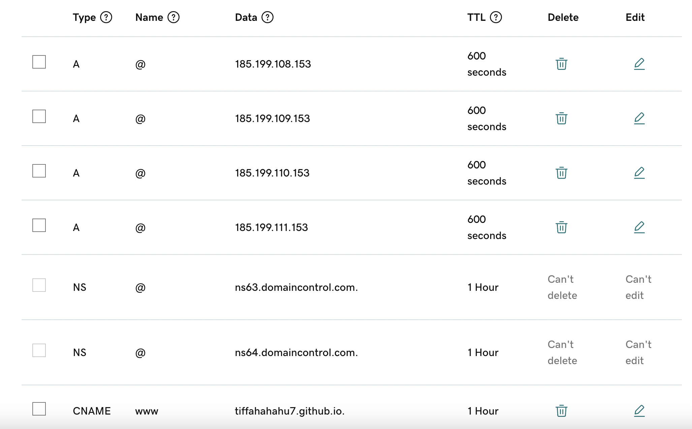
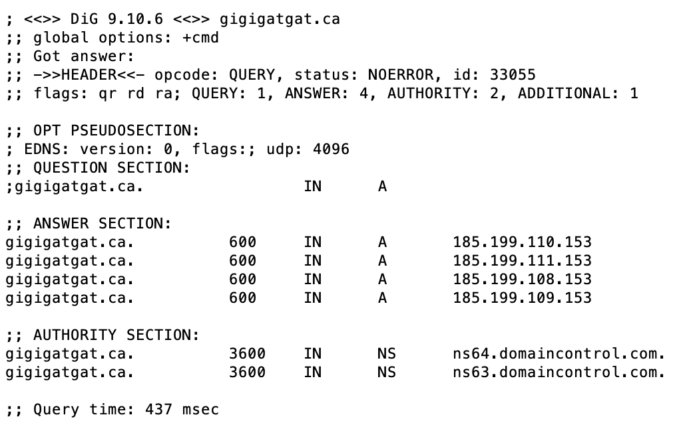

Frankly speaking, I don't like the official GitHub Doc on [Configuring a custom domain for your GitHub Pages site](https://docs.github.com/en/pages/configuring-a-custom-domain-for-your-github-pages-site).  It contained too much information with a questionable order of steps, making it harder to read and far less straightforward for someone attempting the action for the first time. Recently I added two custom domain names for my own blog (YES, our URL is now updated to `gigiggatgat.ca` ! Cheers!) and my friend's blog. Despite following the exact same steps, my experience was still different, leaving me confused at certain points. This post aims to demonstrate how simple configuring a custom domain name should be and how to troubleshoot possible scenarios. Let's see.
## 1. Buy A Domain Name
I bought from GoDaddy, but you can choose whichever platform you prefer.
## 2. Update DNS Records
In the GoDaddy dashboard, find DNS in the domain settings and make following changes:
- Edit the existing **CNAME record** with Name "www", and update the value to **<_username.github.io_>**, regardless of whether your site is hosted at <_username.github.io_> or <_username.github.io&#47;repository_name_>.
- Edit the existing **A record** with Name "@", and update the value to **185.199.108.153**, which is one of the IP addresses associated with GitHub's server infrastructure, specifically used for serving GitHub Pages websites.
- Click "Add New Record" button and **add 3 more A type record** with Name "@". Their values are respectively **185.199.109.153, 185.199.110.153, 185.199.111.153**.
Generally, there is no need to modify other records or adjust default TTL settings anymore. The table should appear as follows:

## 3. Create CNAME File
There are two ways to create a CNAME file, manually or automatically, each with its own slight pros and cons.
- **Manual**: In the root directory of your website files, (e.g., `public` folder for a Hugo site), create a new file named “CNAME”(all uppercase), and directly add your purchased domain name to it. This method requires an extra step to add, commit, and push your changes to the source branch of Github Pages, `gh-pages` branch in my case.
- **Automatic**: Go to your site's repository on GitHub, then click on Settings - Pages, and save your domain name in the "Custom domain" section. It will automatically add a CNAME file to the root of your source branch and skip step 4 in this article. However, you'll need to run `git pull` or `git pull --no-rebase` later to ensure consistency between your local and remote repositories. It is recommended to run `git pull --no-rebase` if you have no other local changes.
## 4. Save Custom Domain in Settings
As mentioned above, simply go to your site's repository on GitHub, click on Settings - Pages, and save your domain name in the "Custom domain" section. You'll immediately see the "DNS Check in Progress" message. 

If it is unsuccessful, open your terminal and run the command `dig <domain_name>` to check whether your DNS record has been configured correctly. If the result matches the four IP addresses for GitHub Pages, you are good to go. If not, wait for a few minutes and try again. Be patient and relax, as sometimes DNS propagation can take up to 48 hours.

## 5. Enable HTTPS
As simple as checking the “Enforce HTTPS” box below where you typed your domain name in the "Custom domain" section. I wondered for a sec whether I need to buy a separate SSL certificate but thank God HTTPS enforcement is included for any GitHub Pages site. If you're unable to click the checkbox at the moment, just give it a bit more time.
## 6. Extra Step for A Hugo Site
In the config file of your Hugo site, update the baseURL to the absolute URL of your published site (e.g., `https://your_domain.com/`). Please note that the last forward slash sometimes matters as it is related to how your Hugo theme handles relative URLs. It can impact the rendering of stylesheets and other resources, so consider including or removing it based on your specific situation.
## Reference
- [GoDaddy Domain with GitHub Pages](https://jinnabalu.medium.com/godaddy-domain-with-github-pages-62aed906d4ef)
- [Managing a custom domain for your GitHub Pages site](https://docs.github.com/en/pages/configuring-a-custom-domain-for-your-github-pages-site/managing-a-custom-domain-for-your-github-pages-site)
- [Troubleshooting custom domains and GitHub Pages](https://docs.github.com/en/pages/configuring-a-custom-domain-for-your-github-pages-site/troubleshooting-custom-domains-and-github-pages)