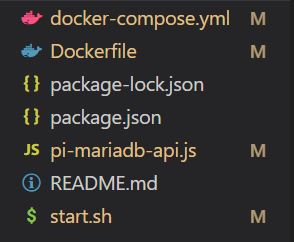
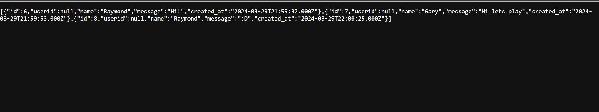

In this guide, we'll explore how to host a RESTful API with MariaDB 10 on a Raspberry Pi using Docker, Express.js, and Ngrok. By containerizing our application with Docker, leveraging the power of Express.js for building the API, and utilizing Ngrok for internet exposure, we'll unlock the potential of the Raspberry Pi as a versatile hub for IoT and home automation projects. Let's get started!

## 1. Setting RESTful API in Express.js

Express.js, a widely embraced JavaScript framework, is known for setting up robust servers. Inside the Express.js, I integrated two more frameworks: **mysql2** and **cors**. The decision to incorporate mysql2 due to its compatibility with MariaDB, as my Raspberry Pi currently supports only the older MariaDB 10 version rather than the latest MySQL version. Furthermore, I employed the **cors** framework to circumvent cross-site policy restrictions seamlessly. Let’s take a look at the finished version of the API codes in Express framework.

```jsx
// import frameworks
const express = require('express');
const mysql = require('mysql2');
const cors = require('cors');

//Express config
const app = express();
app.use(cors());

// Create a connection to the MySQL database
const connection = mysql.createConnection({
  host: '0.tcp.ngrok.io', // Ngrok tunnel URL
  port: 'Xxxxxx', // Ngrok tunnel port
  user: 'Xxxx',
  password: 'Xxxxxx',
  database: 'Xxxxxx'
});

// Connect to the database
connection.connect((err) => {
  if (err) {
    console.error('Error connecting to MySQL database:', err);
    return;
  }
  console.log('Connected to MySQL database');
});

// Listening to the Get request on "/messages" route
app.get('/messages', (req, res) => {
  // Retrieve all messages from the database
  connection.query('SELECT * FROM user_messages', (err, results) => {
    if (err) {
      console.error('Error retrieving messages:', err);
      res.status(500).send('Internal Server Error');
      return;
    }
    res.json(results);
  });
});

const port = 8080;
app.listen(port, async () => {
  console.log(`Server is listening on port ${port}`);
});
```

### Let’s break them down into pieces

```jsx
**const app = express();**
```

Here, we're initializing an Express application. Think of it as creating a canvas where we'll paint our server-side logic and routes. **`app`** becomes our gateway to handle HTTP requests and responses.

```jsx
**app.use(cors());**
```

app.use() is widely used to set up middleware. This line sets up Cross-Origin Resource Sharing (CORS) middleware. CORS is essential for allowing our API to be accessed by web pages from different origins (domains). It helps bypass browser security restrictions by allowing specified origins to access our server's resources.

```jsx
// Create a connection to the MySQL database
const connection = mysql.createConnection({
  host: '0.tcp.ngrok.io', // Your designated Ngrok tunnel URL
  port: 'XXXX', // Your designated Ngrok tunnel port
  user: 'xxxx', // Your database user
  password: 'xxxxx', // Your corresponding database user's password
  database: 'xxxxxx' // Targeted database
});
```

This code snippet creates a connection to the MaridDB on Raspberry PI using the **`mysql2`** package. The connection parameters encompass essential details like the host (configured with the Ngrok tunnel URL for remote accessibility), port (mapped to the Ngrok tunnel port), username, password, and the specific database name.

Given that this API will reside within a Docker container, it's isolated from direct access to the MariaDB server on the Raspberry Pi. To address this limitation, one solution involves exposing the Pi's MariaDB server through a TCP tunnel URL. By securely making the server public using Ngrok, the container then can establish access to the Pi's MariaDB server at Ngrok’s public TCP tunneling.

To execute this connection successfully, it's imperative to register for a [Ngrok account](https://ngrok.com/) and install Ngrok on the PI to configure the tunnel accordingly. This setup ensures secure and efficient communication between the Docker container and the MariaDB server on the Raspberry Pi.

```jsx
ngrok tcp 3306
```

After successfully installation, you can simply run the above code on your PI’s terminal to instruct Ngrok to create a TCP connection between its public server and your PI’s 3306 port, which is the port normally MySQL server running at. If all things go well, you may get a public link similar to “**tcp://0.tcp.ngrok.io:XXXXX**”, and then just apply corresponding parts to the connection configuration as above. 

```jsx
ngrok http 8080
```

Here's an additional Ngrok action: publishing its own port 8080. This action is taken to make the container's service accessible to the public via the Pi's port 8080. I'll provide further details in the explanation that follows.

```jsx
// Connect to the database
connection.connect((err) => {
  if (err) {
    console.error('Error connecting to MySQL database:', err);
    return;
  }
  console.log('Connected to MySQL database');
});
```

Once the connection object is configured, we attempt to connect to the database using the **`connect`** method. If an error occurs during the connection process, it will be logged to the console. Otherwise, a success message confirming the connection is printed to the console. This setup enables our Node.js application to interact with the MariaDB database hosted on the Raspberry Pi via Ngrok tunneling.

```jsx
// Listening to the Get request on "/messages" route
app.get('/messages', (req, res) => {
  // Retrieve all messages from the database
  connection.query('SELECT * FROM user_messages', (err, results) => {
    if (err) {
      console.error('Error retrieving messages:', err);
      res.status(500).send('Internal Server Error');
      return;
    }
    res.json(results);
  });
});
```

For simplification, this API will only listens for a GET request on the "/messages" route using Express.js. Upon receiving the request, it executes a query to retrieve all messages from the "user_messages" table in the database. If an error occurs during the database query, it logs the error and sends a 500 Internal Server Error response. Otherwise, it sends the retrieved messages as a JSON response to the client.

```jsx
const port = 8080;
app.listen(port, async () => {
  console.log(`Server is listening on port ${port}`);
});
```

Lastly, this code sets the port number to 8080 and instructs the Express application to listen for incoming connections on that port. Once the server is successfully listening, it logs a message indicating the server is up and running on the specified port.

## 2. Configurating Docker image build

After completing the API code setup, it's time to configurate how to build and run the Docker image. While for this project, having just one service - the API service - makes it feasible to solely utilize a **Dockerfile** without creating a new **docker-compose.yml**, I personally opt for using docker-compose.yml to enhance the clarity and structure of my services. However, the choice ultimately rests with you.

### Dockerfile

```
FROM node:18

# Install ngrok
RUN curl -s https://ngrok-agent.s3.amazonaws.com/ngrok.asc \
    | tee /etc/apt/trusted.gpg.d/ngrok.asc >/dev/null && \
    echo "deb https://ngrok-agent.s3.amazonaws.com buster main" \
    | tee /etc/apt/sources.list.d/ngrok.list && \
    apt-get update && \
    apt-get install -y ngrok

# Set working directory inside the container
WORKDIR /app

# Copy package.json and package-lock.json to the container
COPY package*.json ./

# Install dependencies
RUN npm install

# Copy the rest of the application code to the container
COPY . .

# Set executable permissions for the start script
RUN chmod +x start.sh

# Command to run the application using the start script
CMD ["./start.sh"]

```

### Let’s break them down into pieces

```jsx
FROM node:18
```

This line specifies the base image to use for the container, in this case, it's a Node.js image with version 18.

```jsx
# Install ngrok
RUN curl -s https://ngrok-agent.s3.amazonaws.com/ngrok.asc \
    | tee /etc/apt/trusted.gpg.d/ngrok.asc >/dev/null && \
    echo "deb https://ngrok-agent.s3.amazonaws.com buster main" \
    | tee /etc/apt/sources.list.d/ngrok.list && \
    apt-get update && \
    apt-get install -y ngrok
```

This section comes from the official Ngrok’s instruction, telling the container to install Ngrok by adding the Ngrok repository and installing the Ngrok package using apt-get.

```jsx
# Set executable permissions for the start script
RUN chmod +x start.sh

# Command to run the application using the start script
CMD ["./start.sh"]
```

These syntaxes set executable permissions for the **`[start.sh](http://start.sh)`** script and specifies the command to run when the container starts, which is executing the **`start.sh`** script. **`start.sh` is a shell script** includes multiple commands to configures Ngrok with an authentication token and runs a Node.js application in the background and so on. Here is the **`start.sh`:**

```
# Configure ngrok authentication token
ngrok config add-authtoken <Your token>

# Run your Node.js application in the background
node pi-mariadb-api.js 
```

1. **Configure ngrok authentication token**: Sets up Ngrok with an authentication token.
2. **Run your Node.js application in the background**: Starts the Node.js application **`pi-mariadb-api.js`** in the background.

### docker-compose.yml

```
version: '3.3'

services:
  pi-mariadb-api:
    build: .
    ports:
      - "8080:8080"
    networks:
      - backend

networks:
  backend:
```

After successfully building the Docker image using the provided Dockerfile, the above docker-compose.yml will guide the container to expose itself on port 8080 and connect with the Pi at port 8080. It's important to note that these two ports are different. The first one (exposed by ngrok) is the port number we asked Ngrok to publish online previously when the second one is the port number container expose itself at.

Here's the flow: When external users access Ngrok's public link, they will communicate with the Pi's port 8080. Since this port is also where the container renders its services, users will ultimately access the API service offered by the container. Essentially, the Pi's 8080 port acts as a bridge, allowing users to reach the container's port 8080 and access to the API service.

### Here is the folder structure



Remember to place all mentioned files in the same directory.

## 3. Build and run the Docker image

Once you've completed all preliminary setup steps, you can utilize Docker Hub or the SCP method to transfer the entire folder to your Pi. Before executing the build and run Docker commands, ensure that you have installed the [docker.io](http://docker.io) and docker-compose packages on your Pi. Then, head to the directory where your docker-compose.umm resides and simply run command**:**

```
docker-compose up
```

Wait for everything done and then just go to the public URL provided by Ngrok when running “**ngrok http 8080**” and route “/messages”. There you go! We can get JSON data from the PI’s MariaDB database via a public address!



Initially, my preference leaned towards using C# and [ASP.NET](http://asp.net/) for crafting the backend of my RESTful API application. The intermediate language level of C# promised better performance, especially for backend tasks. However, upon delving deeper, I encountered compatibility issues with the .NET platform in Docker container environments. Consequently, I pivoted towards using Express.js.

There is one thing I would like to remind you of again. For this project, a total of two Ngrok public URLs were used. The first one was created to establish a public TCP connection in order to make the PI's MariaDB server public. The second one was created to establish an HTTP connection so that the container's API service can be made public. Because one Ngrok account can only have one free public tunnelling endpoint, in this case I use two different accounts.

Originally, I intended to create two containers directly within the same Docker network, with one handling the API service and the other handling the database service. However, I couldn't find a suitable MySQL image for modeling on my aarch64-based Raspberry Pi, so I ended up using this approach instead. I hope everyone likes it :)!!!