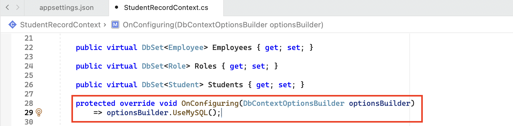
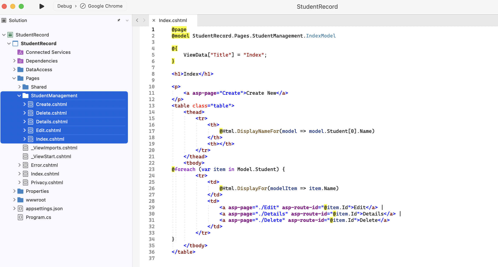
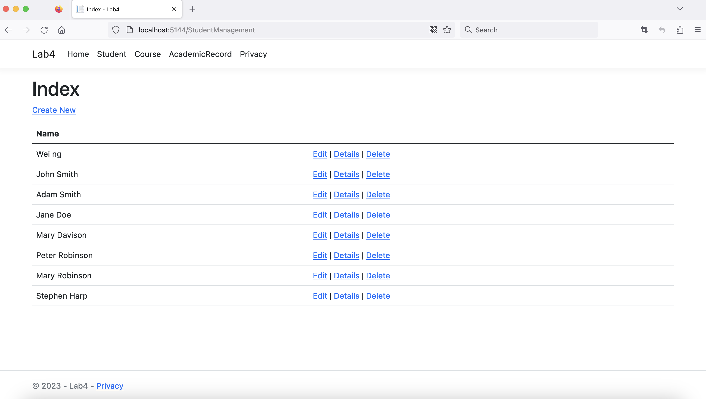


Entity Framework Core is a powerful tool for simplifying database integration with web applications.


In this article, we'll gain a basic understanding of Entity Framework Core and demonstrate how it streamlines the process of connecting databases to your web pages. You'll also find step-by-step instructions to help you get started, regardless of whether you're a Windows or Mac user. Since I'm a Mac user, most of the screenshots in this tutorial will be from a Mac system.

## What is Entity Framework Core?

**Entity Framework Core (EF Core)** is an open-source and lightweight framework developed by Microsoft. It is widely used in .NET applications to help developers interact with relational databases and convert data into entity classes in a more object-oriented manner. This tool also enables automatic generation of Razor pages with accessible data and default layout settings.
<br>
You can install EF Core on NuGet public domain to your web application projects in Visual Studio. 
## Prerequisites 
- Installed Visual Studio and MySql Workbench
- Connect to local instance in MySql and ensure the server status is **Running**
- A populated database to be converted to classes and displayed on web pages
	- In my case, I created a new scheme named StudentRecord and ran the sql file [StudentRecordDBBuilder.MySQL.sql](https://drive.google.com/file/d/1bBJORcZ0EEZJMU3sNsRaKD4LhOobh3Iv/view?usp=share_link) to populate it 
- Basic knowledge about ASP.NET and Razor Page

## Procedures

### 1. Create a new ASP.NET Razor Page web application project in Visual Studio
- Choose the **Web Application** template for creating an ASP.NET Core application with example ASP.NET Razor Page content
- Select **.NET 7.0** as the targeted frame
- Uncheck **Configure for HTTPS**
- Name the project and solution as you prefer, and place the folder in a location that best suits you


### 2. Install Microsoft Entity Framework Core

- Right click on the project folder and select **Manage NuGet Packages**
- Select **Browse** tab, and select **nuget.org** as the package source. Search and install the following three packages to the project. You may need to click **Accept** if a License Acceptance window pops up. 
	- **MySql.EntityFrameworkCore**
	- **Microsoft.EntityFrameworkCore.Tools**
	- **Microsoft.VisualStudio.Web.CodeGeneration.Design**
- Double check whether these three packages are installed successfully by expanding the project’s **Dependencies and Packages** or browsing the **Installed** tab in the **NuGet Packages Manager's** window


### 3. Generate the entity classes from the database
- Create a folder **DataAccess** in the project to contain the generated classes
	#### for MacOS
	- Select **Show Terminal Window** from **Tools** in the menu if the terminal window is hiding
	- Run the following commands in the VS terminal window:
		- to create a new Tool Manifest: `dotnet new tool-manifest`
		- to install dotnet-ef: `dotnet tool install dotnet-ef`
		- to make the dotnet-ef command available: `dotnet tool restore`
		- to generate classes for each tables in the database and the DataContext class: 
		<br>
		`dotnet dotnet-ef dbcontext Scaffold "Server=localhost; User ID=root; Password=yourPassword; Database=yourDatabaseName" MySql.EntityFrameworkCore -o DataAccess`
	#### for Windows
	- Select **NuGet Package Manager** from Tools in the menu and start **NuGet Package Manager Console**
	- Run the following command with your own credentials: 
	<br>
	`Scaffold-DbContext “Server=localhost; User ID=root; Password=yourPassword; Database=yourDatabaseName” MySql.EntityFrameworkCore -o DataAccess`


Remember to use **your own credentials** in the Scaffold command instead of copying and pasting!

- By finishing the above steps, the Entity Framework scaffold tool will generate a set of class files in the **DataAccess** folder


### 4. Modify the DB connection string for security concerns
- Add a **ConnectionStrings** section with one connection string using the same name of your database in the application’s configuration file **appsetting.json**

- Remove the hardcoded connection string in the **DB Context Class** file, e.g. StudentRecordContext.cs

### 5. Register the DB Access Service with the Application
- In the **Program.cs** file, add the following statements to the beginning: 
```
using Microsoft.EntityFrameworkCore; 
using <ProjectName>.DataAccess;
```
- In the same file, add the following codes after **builder.Services.AddRazorPages( )**:
```
string dbConnStr = builder.Configuration.GetConnectionString("StudentRecord");
if (dbConnStr != null)
{
    builder.Services.AddDbContext<StudentRecordContext>(
        options => options.UseMySQL(dbConnStr));
}
```

- Select **Rebuild Solution** from **Build** in the menu and ensure that the solution build successfully
### 6. Generate Razor pages using Entity Framework (CRUD)
- Add a new folder inside the Pages folder, right click on the folder and select **Add > New Scaffolding**
- Select **Razor Pages using Entity Framework (CRUD)** and choose the corresponding model class and data context class you'd like to apply

- By finishing the above steps, the CRUD Razor pages are already generated inside the folder

### 7. Review and modify the pages according to your needs
- In the **\_Layout.cshtml** page, add menu items in the navbar to access the newly generated pages from the index page
- Run the application and view the pages in browser

## Common Errors
Debugging is a common practice in application development. One of my biggest challenges in this project is running the **Scaffold command**. I've listed a few errors that I encountered and their respective solutions below.
### 1. Unable to find provider assembly 'MySql.EntityFrameworkCore'
I re-installed 'MySql.EntityFrameworkCore' with a different version(7.0.5) and forgot to update it. Rebuild the solution will solve this issue.
### 2. Missing required argument '\<Provider\>'
Double-check the quotation marks in the command. In my case, I mistakenly used Chinese quotation marks.
### 3. Authentication to host 'localhost' for user 'root' using method 'caching_sha2_password' failed with message: access denied for user 'root'@'localhost' (using password: yes)
If you are absolutely certain that you are using the correct password, it's likely that a special character in the password is causing confusion in the terminal/console. You can change the password to a simpler one or create a new temporary user with all privileges and try again.
## Credit
This blog is inspired from a lab assignment of the course CST8256 Web Programming Language I, with an original instruction written by Wei Gong.