
#Blog逛超市安利大會


我和對象都屬於是日常消費慾望較低的人，只有每週一次的逛超市是雷打不動的例行任務。去超市買什麼？我不僅有選擇困難症還有嚐鮮恐懼心理，出於口味差別的原因對加拿大的加工食品和冷凍食品都沒有信心，在沒有做功課或者被種草的前提下很少會主動購買沒試過的產品。但是！只要是買過一次讓人滿意的，就會頻繁在我的購物清單上再度出現，成為一個安全可靠的長期選擇。

雖然說蘿蔔青菜各有所愛，但分享下我的回購清單多多少少也可當個參考。以下推薦完全沒有廣告價值（我不值得），也不會有鏈接，我最多提下主要是在哪個超市買的。也歡迎友鄰在評論裡或者另起一篇blog嘮嘮你們的日常愛買選品，想被種草！
## 生鮮
### Melon Honeydew
所有水果裡最喜歡這款蜜瓜，請認準honeydew！它很甜，但是相比cantaloupe的甜膩，它會更清新一點。我們一年裡買了超多次，我對它的價格也瞭如指掌：打折5.99-6.99一個，平時7.99。我們多數是在Loblaws買，唯一一次不怎麼甜的是在Real Canadian Superstore買的個頭相對小點的蜜瓜。Loblaws的個頭通常蠻大的，買回家切一切分裝，兩個人都可以吃兩三天，一個人吃怕壞的話可以放一半去冷凍。
### Apple HoneyCrisp
我初來乍到的時候逛超市看著整行的不同蘋果種類就很懵圈，不知道買哪種好。我脆蘋果和面蘋果都吃，喜甜不喜酸，HoneyCrisp是個人相對不踩雷的選項，Mcintosh已經被我拉黑（也不是酸的問題，覺得皮很厚，口感很澀很硬），gala時好時壞。因為不是資深蘋果愛好者，其實也沒有買過很多次，但下次如果再買的話我會從honeycrisp、opal、sugarbee、ambrosia裡面選，這四種是小紅書的北美蘋果分析帖裡較多被推薦的品類。再附一張網上找的蘋果甜酸度對比表（這個劃分很簡單粗暴，僅供參考）：
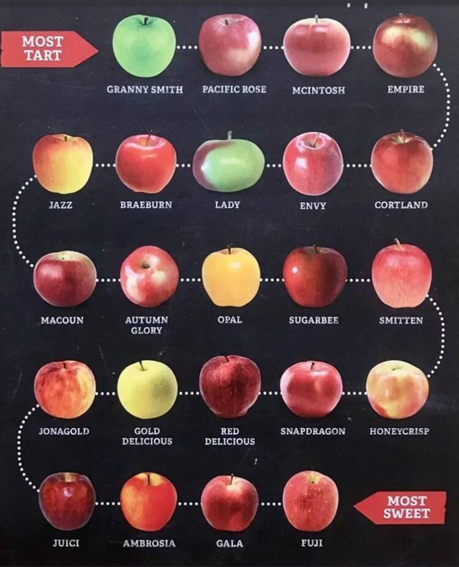
## 乳製品
### Neilson half & half cream
<!-- 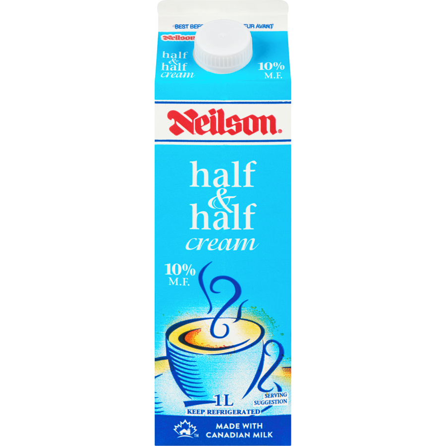 -->

half milk half cream，我們家最喜歡的咖啡伴侶。最開始知道half half是因為受小紅書推薦在Starbucks點了杯 iced shaken espresso with half and half，一喝又確實好好喝喔，成為了我的星巴克固定點單選擇之一。星巴克用的其實也是超市開架牌子的half half，我不記得具體是哪個牌子了，但應該都差不多，neilson這款也不錯。
### Philadelphia cream cheese
<!-- 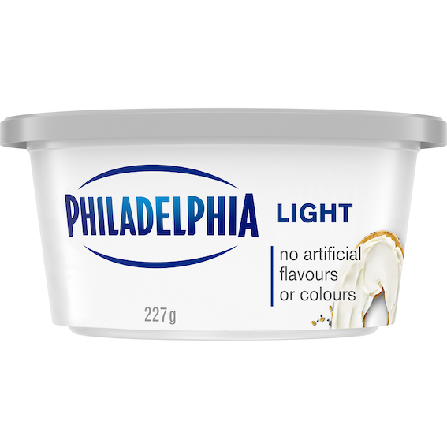 -->

吃過原味（light）、herb&garlic和mixed berry的cream cheese，都好吃，抹烤麵包或者bagel一絕。方便快手的早餐搭配選擇。
### 黑白/三花淡奶
<!-- 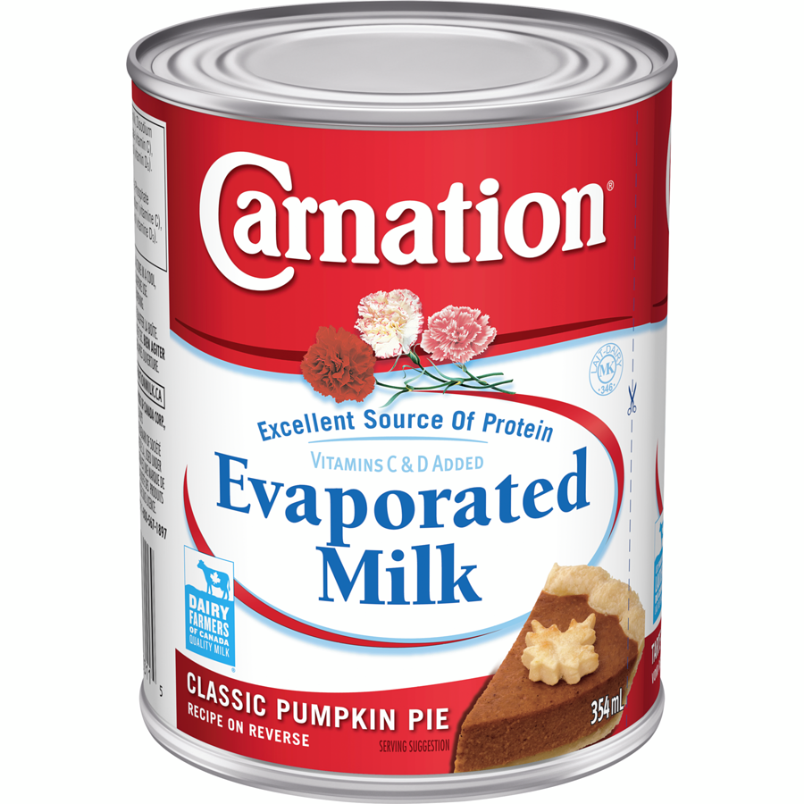 -->

家裡常備淡奶是為了隨時可以做[譚仔]()，作為湯底調料黑白和三花都買過，吃不出分別，黑白只是多一點港式奶茶情懷，煮奶茶會更合適。西人超市的話三花比較容易買到，看了眼網站walmart最近打折才1.27一罐，與此同時大統華賣3.29(｡ŏ_ŏ)。

買淡奶最大的煩惱是開罐後的保存問題，如果不及時處理容易變質甚至發霉。我們家試過開罐後全部倒進密封袋放冷藏儘快消耗，但最近我想出來的一個天才對策是倒冰格冷凍成小塊，可保存時間更久而且也容易計量取用～
### Silk豆奶
<!-- 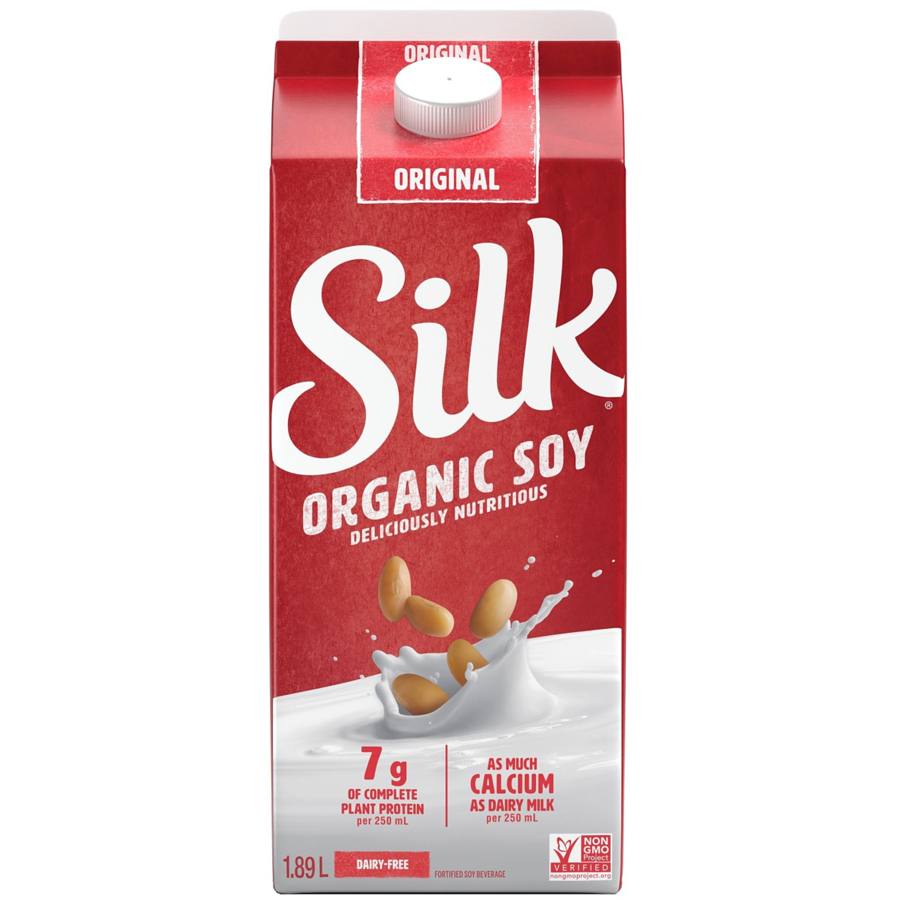 -->

我最喜歡的豆奶牌子（說得好像我有橫向比較過很多其它牌子似的），每次都是兩盒1.89L的直接抱回家。買的時候要注意看它頭頂的標籤，有unsweetened、original和vanilla的區別。我之前不怎麼留意，很少買到original的，unsweetened的是真的一點兒不甜味道比較淡，vanilla其實不會太甜反而我很喜歡。
## 零食
我不太愛吃零食，這個大類下的items主要是平時逛著逛著突然就被Sloth又又又又丟進了購物車的東西——但買回家之後我也會搶著吃就是了(๑´ڡ\`๑)
### PC Jalapeño薯片
<!-- 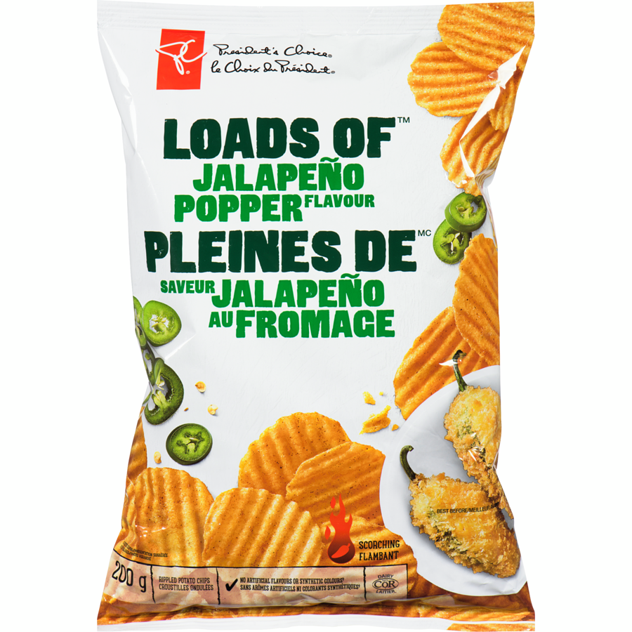 -->

Jalapeño是最受歡迎的一種墨西哥辣椒，在國內時沒有聽說過，但是在加拿大還蠻常見的，應用範圍也很廣——tims就有Jalapeño bagel和Jalapeño pastries（我在[tims菜單點評]() 裡就提過我很喜歡它的Jalapeño pastries）。PC這款薯片也很好吃，辣辣的很上癮。PC是loblaws的牌子，所以只能在loblaws旗下超市買到，但這個口味的薯片其實各個牌子都有，只是因為我們第一次吃是PC的就忠實於它了。
### Ricola喉糖
<!-- 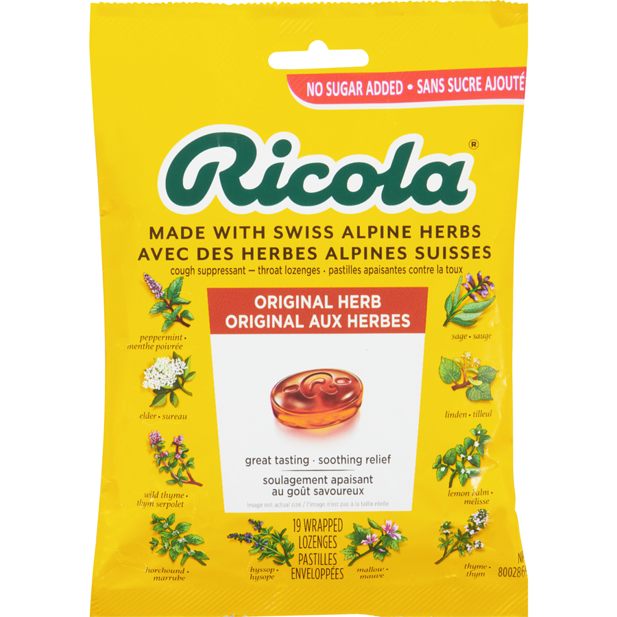 -->

把喉糖歸類在零食裡好像很不尊重喉糖，但這就是喉糖在我心裡的定位(〃∀〃)。我們最常買的是original herb口味（根本就沒有試過其他口味），一股淡淡的藥草味很迷人，會讓我莫名想起廣東涼茶。Sloth說他小時候在廣東已經很喜歡吃這個糖，但他不認同像涼茶味LOL
### Kinder Bueno繽紛樂
<!-- 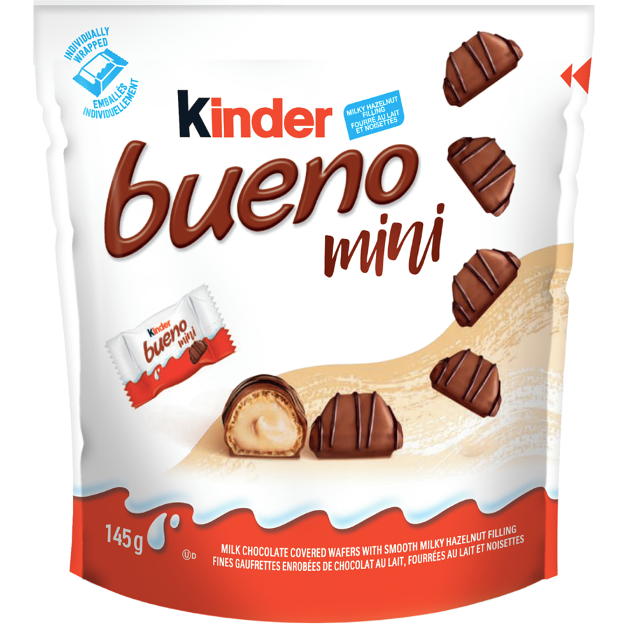 -->

也是Sloth的摯愛。很奇怪，他不吃其它任何巧克力，但是唯愛這款繽紛樂。想抄一下健達官網對這款產品的介紹：「健達繽紛樂，牛奶巧克力加上威化外層, 含綿滑牛奶及榛果內餡。獨特口感，多重享受。」確實挺好吃的，我覺得是肚子餓時很適合飽腹救急的一個選擇（好實用主義的一個出發點），上晚課時摸兩顆出來吃吃很方便。
## 飲料
### Canada Dry

我對poutine是加拿大國菜感到嗤之以鼻，但canada dry一定是當之無愧的加拿大國寶級汽水！它主打的是ginger ale薑汁汽水，我只買過原味的，並且因為原味的已經很經典很好喝暫時沒考慮過試其它味道。我覺得不喜歡生薑味和不喜歡ginger ale是兩碼事，反正後者也沒多少生薑含量，它更像是一種味道層次更豐富的雪碧= =。來了加拿大我第一推薦這款汽水！
### NESCAFÉ GOLD Espresso速溶咖啡
<!--  -->

還沒有擁有自己的咖啡機，所以在家都是喝速溶湊和湊和。我不想在貨架上盲買，雀巢NESCAFÉ GOLD系列是我做了些功課後看到風評最好的速溶咖啡了，買完也沒有失望，沖出來油脂很豐富很香很好喝，就一直接著買下去了。Loblaws一般商品標價其實都偏高，但很神奇的這款咖啡定價還低過平民超市walmart，200g12刀，抵買！
### T&T茉莉綠茶
<!-- 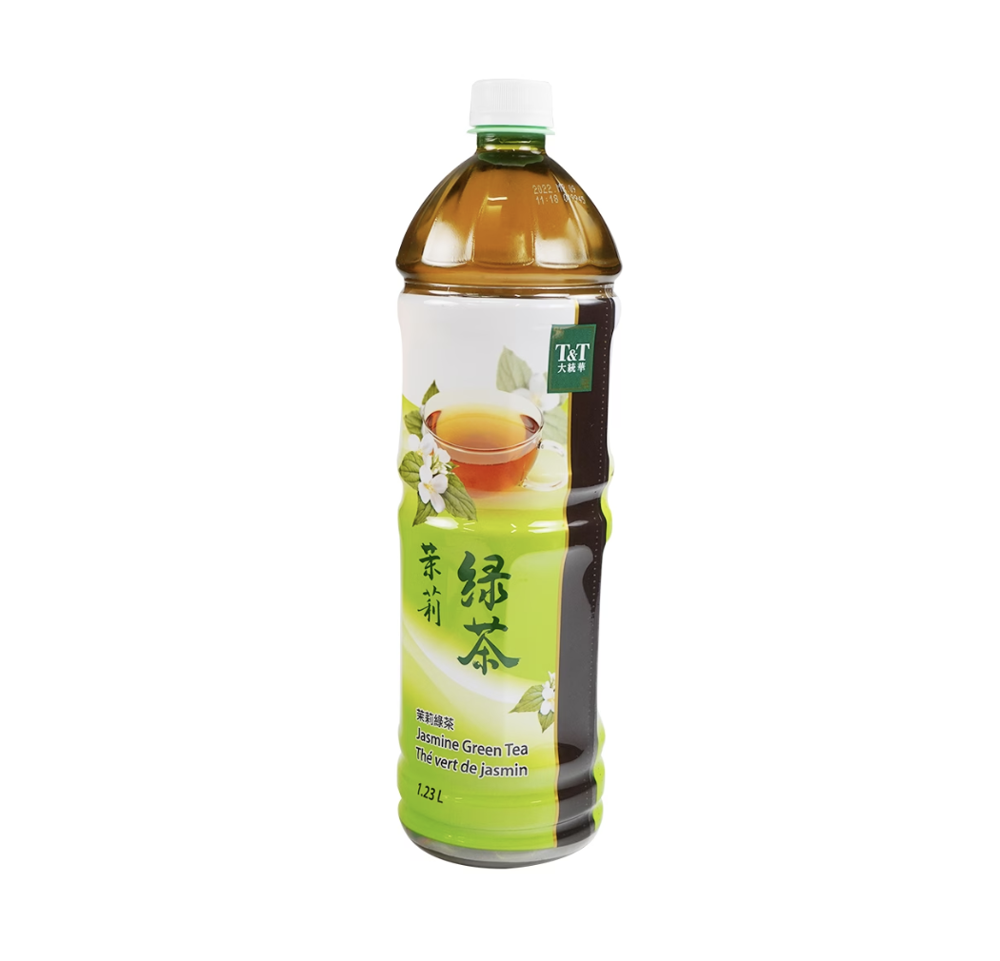 -->

大統華牌子的茉莉綠茶，但是在loblaws買也比在大統華買便宜，2.49刀和3.95刀的差價。茉莉綠茶應該很難不好喝吧！西人超市賣的大多是需要沖泡的茶包，我們圖方便且想喝冷茶的時候就會直接倒這個，甜度也合適。Loblaws沒見過無糖款，但大統華官網的無糖款評價也不錯。
## 雪糕
### 哈根達斯抹茶/咖啡
<!-- 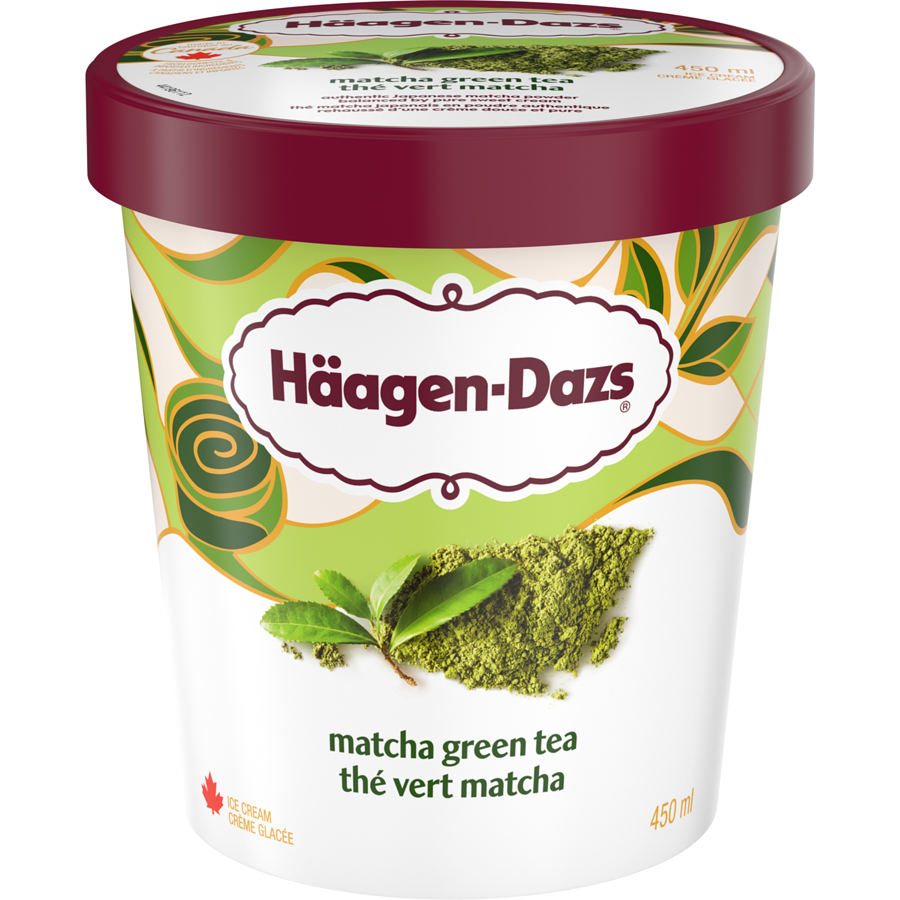 -->

如果說有什麼在加拿大買是比國內買划算很多的，那一定是哈根達斯了。兩大罐450ml的常見打包價10刀，換算起來幾乎是國內單價的七分之一，我們基本上每隔兩週就買兩罐⋯⋯每餐飯後都舀幾勺吃吃好幸福。因為不嗜甜，所有口味裡我們只喜歡抹茶和咖啡，甜中帶苦的味道是最迷人的不接受反駁。
### 樂天Mochi香草味
<!-- 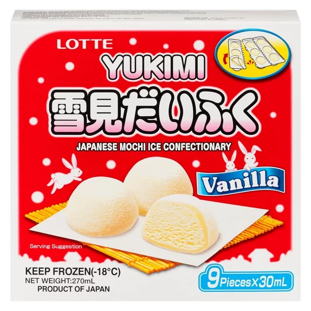 -->

在Walmart淘到的樂天香草味的雪糕糯米糍，一口一個超好吃！能進這個貨我覺得Walmart採購真的很有眼光，美中不足的是太受歡迎時常缺貨。在我們家附近的Walmart它通常被擺在冰櫃的最高一層，我們每次都要跳起來去夠最裡面剩下的一盒或者兩盒⋯⋯這款糯米糍隔壁還會擺另外一個牌子buono的混合口味糯米糍，餘量總是很多aka沒人買。我試過一次，很後悔，只能說沒人買是有原因的。
### Melona蜜瓜味
<!-- 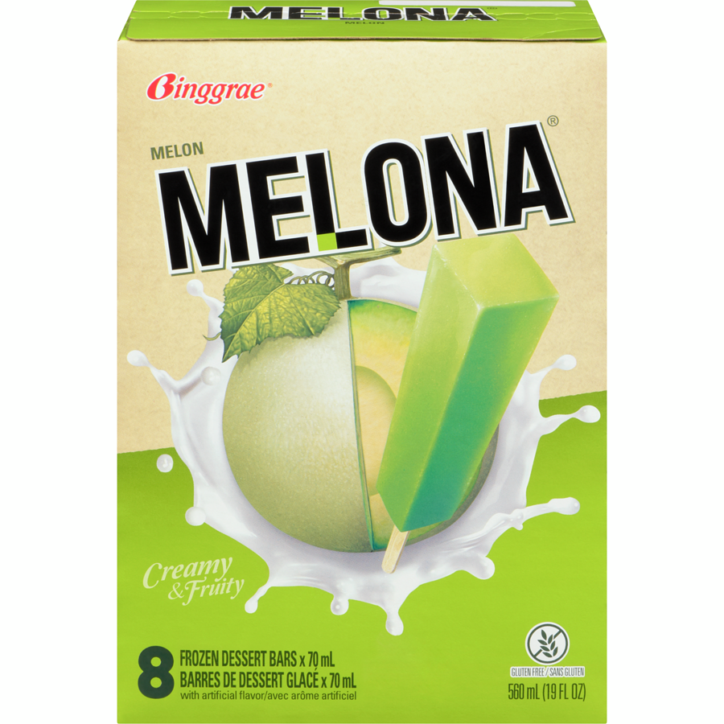 -->

是Sloth介紹給我的他在香港時就很喜歡吃的雪條，是一個韓國牌子，發現加拿大也有還怪驚喜的。我們吃過蜜瓜味和椰子味，最常買的還是蜜瓜，很清爽，不齁甜。蜜瓜味的雪糕好像還挺少見的，感謝melona開發這個口味的產品並且打下加拿大市場(｀･ω･´)ゞ

這個回購清單寫下來確實也——不怎麼長，而且和加拿大本土的關聯性也不是特別強= = 看得出來我們買得很保守挑的還大多是國際牌子。但是買得開心吃著好吃就好啦！日子過著過著超市逛著逛著也總會開拓新的嘗試的。

我們平時常去的超市主要是Loblaws、Walmart和Food Basics。因為最近~~有了腿~~ 買了車，下個月開始應該會更多去Costco購物，隔個一年半載可能會再更新下這個Grocery回購系列，歡迎和我推薦Costco什麼值得買！