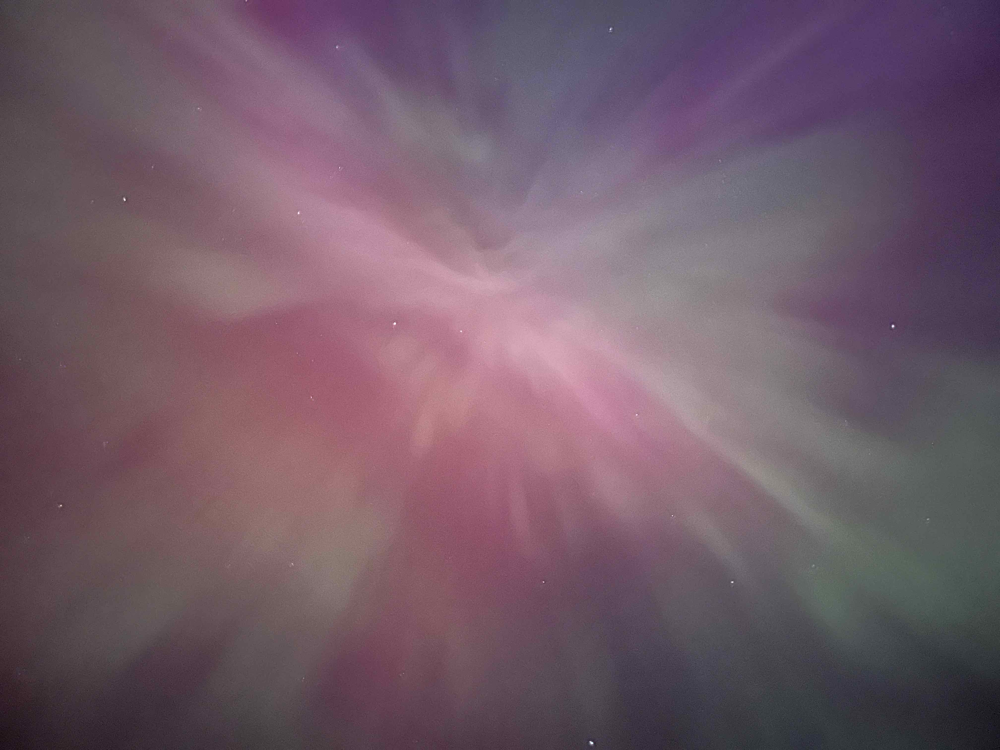
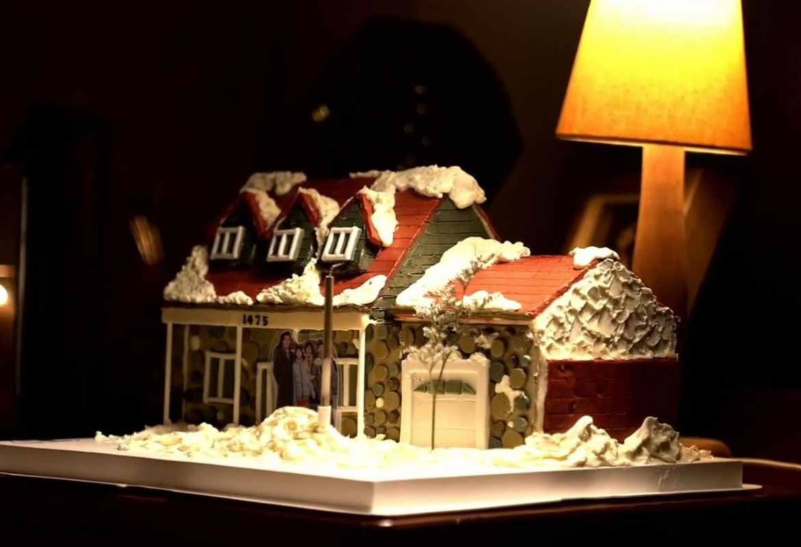
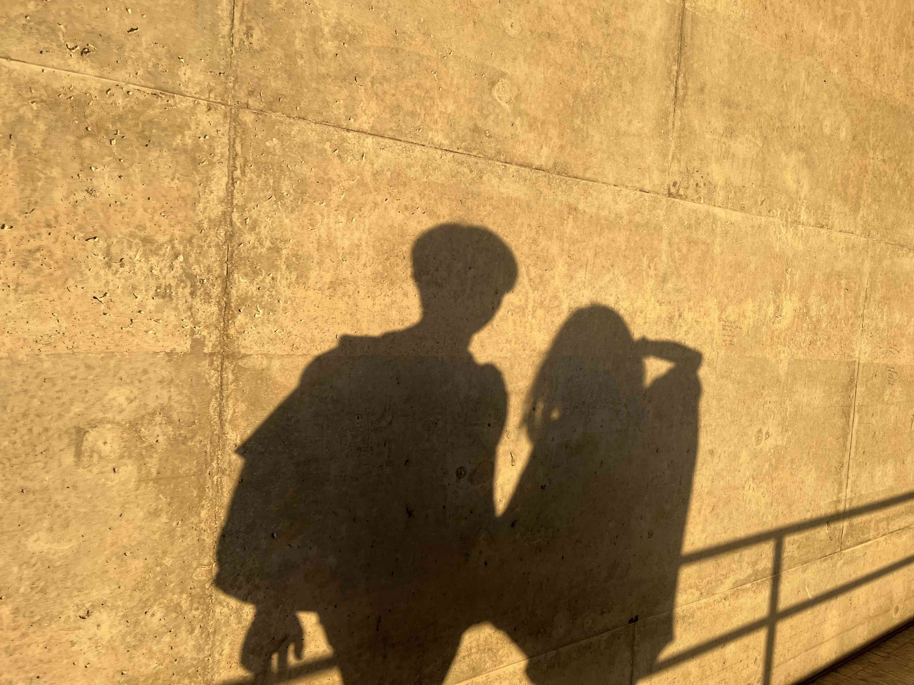

## 本月Milestones
### 提交PR申請
終於在五月中旬和對象一起提交了PR申請，心頭一塊大石也落地。出發時咬著牙要在五年內實現的目標，假想了各種最壞的可能和需要付出的努力，沒想到在第二年就靠common-law partner身份的捷徑輕輕鬆鬆達成了，在「潤」這條路上我確實是被命運眷顧的人，也要謝謝Sloth在開學第一天就穿過人群找我搭上了話>3<。和屬於family class的common-law partner sponsorship application不同，我和對象走的是under humanitarian class的港人通道，所需材料和申請流程都不太一樣，參考意義不大，所以沒想著專門總結回顧。在這裡小小慶祝一筆就好！

不過因為申請和積壓的case眾多，目前這條通道審理的速度也非常遲滯，隨手貼一篇歪腦最近關於移加港人身份困局的[報道](https://www.wainao.me/wainao-reads/slow-lifeboat-Hong-Kongers-identity-crisis-05202024)。樂觀估計的話我們也需要等待至少十八個月才有結果，finger crossed🤞
### 極光打卡
在小紅書上看到的極光預告，一開始還沒特別想著去，結果算法越推越多，我也越研究越來勁。確定了時間和路線之後當晚就和對象說走就走地出發了。跟著導航路線途徑一片曠野，已經有四五輛車在那裡停車等候，我們接著向前開了一會兒卻發現雲層越來越厚，索性掉頭回到了那塊不知名的區域。事實證明這是一個很正確的決定，那裡視野開闊星光點點，不出十分鐘我們就看到了極光。原來肉眼看到的極光並不像照片裡的色彩飽和度那麼高，只能看到隱隱綽綽的綠色和紫色，更多的是近乎半透明的顏色在空中形成寬長的弧面。我們所在的點也很巧，不同方向的極光就像匯集在我們頭頂，對著頭頂隨手拍了一張就是炸開的調色盤，可惜手有點抖(〒︿〒)。

這同時也是本新手司機第一次深夜長途出行，精神高度緊繃，來回兩個多小時把我累得夠嗆，短時間內再也不想開這麼久的車去一個地方了！但解鎖了人生其中一項bucket list還是很滿足很開心。
## 本月碎碎念
### HOCC Spring Live
很幸運地從2021年開始就沒有漏下一場她的線上live——線下辦不了，親眼見不到，遠遠地還能一線相連已經很知足。週五早上八點掐著時間起床，一邊戴著耳機洗漱也一邊搖頭晃腦哼《極夜後》。這天也是她生日，直播裡最讓人動容的一個畫面就是方迦南端著紅瓦堆雪小屋形狀的蛋糕出場，那完全是小何在Montreal的家的復刻，不怪得小何秒變哭包。

誠邀大家一起來聽這場mini live收尾的法文歌Rien que toi et moi，好詩意好喜歡。發現我最喜歡的一個瞬間也被選為了這個視頻的cover image：「On doit pas avoir peur」來吧，我們不用怕。

<iframe width="100%" height="315" src="https://www.youtube.com/embed/GU2tka0FwBw?si=aZE-Wd2RdE4l6q-W" title="YouTube video player" frameborder="0" allow="accelerometer; autoplay; clipboard-write; encrypted-media; gyroscope; picture-in-picture; web-share" referrerpolicy="strict-origin-when-cross-origin" allowfullscreen></iframe>

### 後院鬼祟事件
我以為我每一天都鎖車了但好像有一天我忘了——後院security camera就拍到晚上十一點半有個黑衣人過來打開了我的車門和後備箱四處查看。還好車裡並沒有什麼值錢玩意兒，目前看來並沒有東西被偷，只是讓我心有餘悸。因為我次日開車時確實觀察到了一些異常，譬如本該在車裡的jump starter跑到了後備箱蓋上、油箱門開了（這輛車有個bug是開後備箱的話油箱門會一起彈開）、駕駛座旁邊的儲物箱也是開蓋狀態⋯⋯我當時只是一頭霧水，事後看到footage汗毛都豎起來了！

我揣測這個人的行為動機是從我車的後窗看到裡面堆積了些東西（雪鏟之類的必備物品），就產生了翻找的好奇心。車裡不應該擺放從窗外就能看見的東西這條道理是真的！！
### 換胎小插曲
我買的這輛08年二手車原本是自帶雪胎和夏胎的，臨換胎了才被職員告知夏胎其中兩個胎有損毀不能使用，因為是AWD要換就要換四個一樣的輪胎，costco給我拉了個表報價是900來刀，是我買這輛車四分之一的價格了！我覺得這輛破車不配一副新胎，最後在kijiji上淘到了300刀的二手胎，又約了一次costco換胎才成功換上了。換完之後職員又說我的雪胎其中之一的牌子和另外仨不一樣，不合標準，到冬天換胎也要重買，心好累⋯⋯那這幾個胎之前是怎麼裝上的！可能找的是不care標準的私人修車廠吧⋯⋯

因為要挑二手胎，我也惡補了一番輪胎知識，包括怎麼用硬幣去判斷tire thread depth是否良好、輪胎規格不同數字代表的含義等等。往好了想不吃虧也不會有這些收獲！
### 崴腳理療體驗
可能看起來有點眼熟，但時間並沒有倒流。我不過是又又又又崴腳了，今年第二次，五年來的第四次。這次是從街角的超市買東西步行回家，不小心踩到高低不平的路面邊緣就崴了。雖然程度沒上次嚴重，但這個頻率讓我忍無可忍地預約了物理治療決定好好對待崴腳這件事。第一次體驗了超聲波療法和電療，怪新奇的。很難說有什麼立竿見影的效果，覺得最直觀有用的還是腳踝固定繃帶，能很明顯地感受到行動借力後更輕鬆了。略有意外的是物理治療的流程原來需要這麼長，至少一個月，每週一到兩次，每次100刀起步，要不是有保險cover我會很心痛的！
### 鬱金香節閉幕式
5月是渥太華一年一度的鬱金香節，我和Sloth拖到閉幕式才想起來去看看號稱百萬朵的鬱金香花海，順便也觀摩下適逢加拿大皇家空軍成立100週年的無人機表演。結果因為前幾天下了好幾場大雨，鬱金香其實凋謝得差不多了沒有看到多少，比鬱金香更多的是慕名而來的遊客，我第一次在渥太華同時看到那麼多人！無人機表演其實沒什麼可稱道的，無非是不同形狀的機型變換，個人覺得並不值得那麼多人兩三個小時的等待——現在的渥太華九點才天黑，所以這個表演9:45才開始！公園裡網絡信號也不好，我們兩手空空什麼也沒帶，真的是字面意義上的等到花兒也謝了= =

我們兩個宅人難得出門，步行過去的路上心情倒是很雀躍，目擊了橫穿馬路的浣熊，走過橋洞的時候借著落日餘暉拍下了一張影子照片。我穿了身類似女巫長袍的裙子，舉起手拍照的時候袖子呈條直線落下來，明明是靜態的照片看著也有一種恣意的飛揚感，喜歡！

## 博客更新
### 已發布
- [牙齒當金洗——口腔護理那些事](https://www.gigigatgat.ca/posts/toothcare/)：至少糾正了一個人的刷牙習慣，🎵就已經 很足夠🎵
## 待看清單
借每月小結記錄幾本之後想看的書：
- 《米拉蒂》：從[不明白播客](https://www.bumingbai.net/2024/05/ep-096-yan-geling/)嚴歌苓這期節目聽到的作品，是嚴歌苓被封殺後寫的第一本毋需經歷中文審查的小說，關於八十年代的歷史和八十年代的知識分子。
- 《成為真正的人》：何韻詩推薦，一本背景取材於台灣三叉山空難/山難事件的小說。
- 《千年悲歡》：何韻詩推薦，艾未未撰寫的三代回憶錄，渥太華公共圖書館居然有收錄英文和法文版。很後知後覺地發現原來他就是艾青的兒子也是鳥巢的設計者之一，我之前對他的印象只有一個非常扁平的「異議藝術家」標籤。