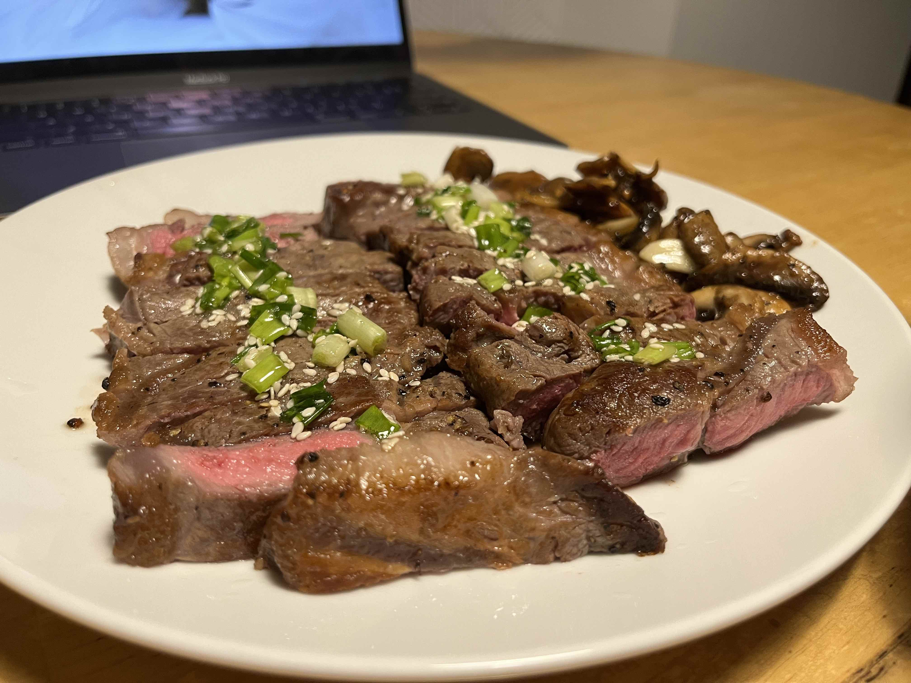
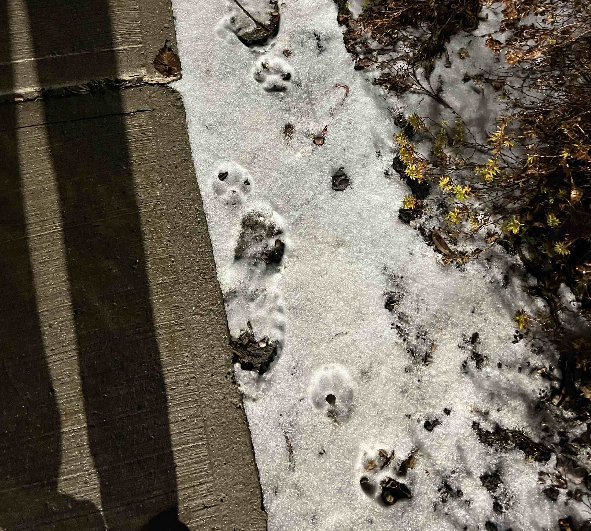


一開始覺得好不容易但是越寫越開心了！


打開一個空文檔然後愣住，我到底要寫些什麼？流水一樣活過去的日子像天上的星星明明暗暗，想重新一顆顆抓回來看個真切也難。時間的概念也模糊，想不起一些事到底是發生在十月還是在十一月，但——這又有什麼重要的呢。看了些友鄰的每月小結博客，最後決定仿照[第三夏爾](https://thirdshire.com/)（我最喜歡看的每月小結！）的結構去梳理自己這個月做了什麼，有哪些值得分享的大事小事。我寫得還算認真，你且先將就看著：
## 本月Milestones
### 練車迎來曙光
因為終於預約了下月初的G牌考試！只有一次跳考機會，所以我慎之又慎，希望能夠一鼓作氣考過！（畢竟車已經買了，考不過只能拿著G1在家裡養著車也太慘了。）雖然我擁有看起來5年駕齡的國內駕照，但實際上路經驗一雙手都數得過來。十月初開始每個星期斷斷續續練2小時車也練了有五六次了，從第一堂課還要學steering control到如今終於對考試有點信心啦！

目前覺得上下高速都不難，最有挑戰性的部分是開出Drive Test Center轉彎併入車流時，對左右來車的距離判斷和駛入中央分隔帶或對面車道的起始速度把控（教練說我總是錯過機會或者太慢了🥹）。Anyway這星期會再針對這個弱點多加練習！然後下星期考試！老天保佑！

Btw我找的是本地教練，收費可以說是全網最低，70刀兩小時，和其他教練60刀一小時的均價相比感天動地。人在Ottawa又有練車需要的網友可以戳我推薦（無利益相關）。
### 黑五買買買
一早聽說Shoppers有黑五250刀積分換400刀的膨脹活動，這一年下來靠Loblaws的週二學生積分日和Shoppers常有出沒的二十倍積分offer，竟和對象一起攢出了750刀積分——然後在黑五換成1200刀全redeem了。因為是第一年在加拿大，確實有很多東西想添置，這次一口氣買了耳機鍵盤投影儀還有dyson吹風機和switch，生活質量大提升！

很同意象友這條關於北美售後服務體驗的[嘟串](https://alive.bar/@linni607/111486109350542468)。我之前買東西都沒有去官網登記的習慣，這兩天在dyson官網登記了產品序列號，看到黑五有complimentary gift的offer，雖然說“only at Dyson”，但打了個客服電話也爽快一起送了$170的梳子和收納盒。還在philips登記了新買的電動牙刷，發現原來買後30天內登記可以多一年的warranty，三年內壞了都可以聯繫保修或者直接以舊換新。穩穩的很安心σ(≧ε≦ｏ)

其他買的七七八八的也不贅述了，如果有特別好用或者難用的再專門分享/吐槽吧！目前最滿意的購入還有Winners淘到的20刀14inch義大利鐵鍋，但鍋這種東西日久見真章，用個半年再看看。
### 煎牛排新晉高手
——我自封的。這個月煎牛排也越來越熟練了呢！參考了[小高姐](https://www.youtube.com/watch?v=PUCLToWjMKs)和一個[台灣YouTuber](https://www.youtube.com/watch?v=EHMOMFmwcx8)的教程，前者只需要開火一次且順帶了醬汁，後者會在第一次大火煎完醒肉後再回鍋小火煎，我自己覺得都挺方便的。而且去Loblaws採購會經常看到真空包裝的冷藏牛排，少了一個解凍的過程也很舒心。

## 本月碎碎念
### 健身掙扎期
學業、打工、博客⋯這個月的瑣碎事堆下來總覺得不夠時間再分給健身。也有一部分原因是天氣凍下來懶得穿穿脫脫( ≧Д≦)。昔日室友[老全](https://weibo.com/7013912275/4968745224372405)建了個運動打卡群，結果我和她兩個人在群裡連著十幾天以靜制動，敵不動我不動，展現了驚人的耐心品質。可惜這個平衡戰局剛剛被打破了，所以我也要振作起來重回健身routine，萬不能輸給老全！
### 燙傷護理
一周前打工時不小心觸碰到了grilling machine的邊緣被燙傷，小臂上留了道5cm長的疤痕。當時正值午餐高峰期，我還記掛著等餐的顧客沒第一時間去沖冷水。事後想來真是，有些責任感大可不必一力承擔的）第一時間請同事幫忙接手才是比較好的處理方式。

燙傷後必須儘快用冷水沖洗足夠長的時間才能有效消減疼痛，網上搜到的時間建議一般是15至30分鐘。我可能就沖了一兩分鐘吧⋯⋯我還犯了個錯就是直接用冰塊冷敷傷口，但這個做法反而會加劇對傷口的刺激。還好燙傷的程度也不算太嚴重，是我能忍到的疼痛程度。現在在Shoppers買了盒Mederma的scar cream每晚塗抹一次，不知道最後效果如何。打字的時候傷口已經到了最癢的結痂階段，我在此嚴正告誡我自己：管好你的手！別摳！
### 雪天二三事
- 十一月的雪下得越來越頻繁，加拿大也轉了冬令時，冬天真的來啦！好喜歡視察下雪後行人道上留下的狗爪印子awww一朵一朵小梅花：

- Sloth喜歡踢球，昨天回家時從巴士站踢回來一團凝固的雪球。過了兩個小時我們出門去超市，走出去兩分鐘他又跑回家門口，我以為他忘帶啥了結果他說忘了踢這塊雪球出來 ლ(⁰⊖⁰ლ)，然後就一路踢去超市。比空氣籃球更過分/過癮的莫過於非空氣足球！ 
- 哥哥說天氣冷了讓我買件好點的羽絨服他報銷(≧∇≦)/。覺得加拿大鵝太厚重還是買了Aritzia Super Puff給老哥省錢嘿嘿。說是也能扛零下二十度，再過一個月看看是不是誠不欺我。
## 博客更新
### 已發布
寫了三篇！不算太懶！
- [A Beginner-Friendly Tutorial for Building a Blog with Hugo, the Blowfish Theme, and GitHub Pages](https://tiffahahahu7.github.io/gigigatgat/zh-tw/posts/how-to-create-a-blog/)：因為我自己在建站的過程中搜了無數教程，一度雲裡霧裡畏手畏腳，現在熬出頭了希望能為人撐傘！對於有足夠coding知識的人來講這篇文章可能顯得很贅述，但我就是以零門檻視角出發寫的步驟。我有不少現實中的朋友擁有敏銳的生活感知力，我也很喜歡她們的文字，如果能把至少其中一個拽進博客宇宙我也心滿意足了～在漫漫互聯網裡能幫到其他人就更好啦。
- [How to Install a Specific Version of Hugo on macOS](https://tiffahahahu7.github.io/gigigatgat/zh-tw/posts/install-specific-hugo-version/)：這篇完全是搭建博客教程的衍生篇，因為我確實遇到了最新版本的hugo和theme版本不兼容的問題，就順勢搜了解法寫了這篇。它其實是在電腦上裝了兩個版本的hugo，需要哪個就調哪個路徑上的版本來用。
- [我的人生廣東歌（一）](https://tiffahahahu7.github.io/gigigatgat/zh-tw/posts/my-fav-cantonese-songs_1/)：極私人的音樂和人生旅程分享。就像在文裡說的，它們是「塑造了我之所以成為我的」廣東歌，在我心裡喚起的共鳴和對我的影響是無可取代。歡迎你來聽。
### 小預告
- **《Tims打工記 附菜單不完全點評》**：已經在學校Tims打工三個月了！不知道有沒有人和我一樣有點單困難症，看著不斷閃動的電子屏已經很焦躁了更別提定制化點單了。我現在算是把Tims大部分菜單吃透了，也有了比較明確的口味偏好，可以整理整理心得供大家參考。
- **《我的人生廣東歌（二）》**：歌是已經選定的，要掏心掏肺地寫是要拖延的。照目前的日程安排不知道年底前能不能寫出來hahaha，放在預告裡也算是表露下我不鴿的決心吧！
## 書影音遊
- 很慚愧，沒怎麼看書，只是在上下學的巴士上斷斷續續地看會兒《綠山牆的安妮》。我小時候沒看過這本書，現在長大了再看，更能體會到安妮的稀有和珍貴——好恣意好天然，放任情感和想像力流動的生命。
- 這個月的下飯劇是《甄嬛傳》和《麻醉風暴》，現在在看《一把青》和《Our Planet2》。原來這是我第一次完整看完甄嬛傳！之前總是還沒看到甘露寺就因為種種原因擱置了。2023年才看完的一個感受就是甄嬛傳台詞真的養了我們很多年的互聯網文化 (屮゜Д゜)屮
- 開玩Switch！目前在玩塞爾達、小小夢魘2、PICO PARK和海綿寶寶攤煎餅（。PICO PARK是之前看3080車隊聯機種草的，應該人越多越好玩，歡迎找我和Sloth聯機！