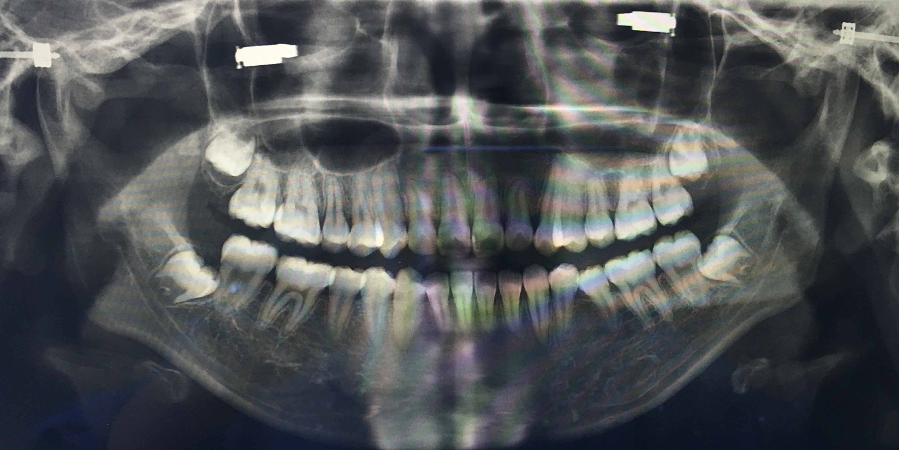

第一次聽「牙齒當金洗」這個說法是在[Goomomoon](https://goomomoon.com/)（何韻詩個人網站）一條LIFETOOLS視頻裡，片名叫「但願我27歲能學懂的6件事」，是我們老何活了45年之際反省人生得出的深痛感悟。牙齒護理是最日常最基礎也最容易被忽視的一件小事。人生做許多事情都不會太晚，唯有牙齒的健康狀況是遲了就難以逆轉的。聽一個45歲（2022年）的人這麼說真的很有信服力（喂！）

恰逢看這條片的前一個月我洗牙經歷了大出血，在那樣痛的領悟中對牙齒護理的重視心態也提到了新的高度。那，到底怎麼護理呢？關於牙線、水牙線、漱口水和刷牙的正確使用順序和方法，網上的資料向來是眾說紛紜。感覺我活了20多年，也是到近年才靠自己摸索出一套相對完整科學的流程。在寫這篇文章之前我又查閱了不少資料，總結出的心得是牙齒護理在步驟上沒有絕對的對錯標準，它不是老中考試選了哪個選項或者漏了哪個選項就扣分，它是在掌握正確方法的基礎上由不同工具排列組合不斷加分的過程，重點是**清潔到位並且養成良好的長期習慣**。
## 我和我的牙齒的愛恨情仇
真正講[日常清潔的推薦順序和Tips](#日常清潔的推薦順序和tips)之前想先嘮嘮我的辛酸牙齒史，當故事會寫的，心急的朋友可以直接跳過這part。
### 正畸
我的牙齒從來都不是一副聽話的牙齒，這一點從小時候換牙就已經初現端倪——我的兩顆上側門牙，即門牙兩側的兩顆牙齒，是從正門牙的後邊長出來的。這樣奇形怪狀的牙不正畸是不行的。當時問了不少牙科醫院，大部分給出的方案都是要我再拔多兩顆恆齒給側門牙騰位置再矯正，最後找到了市裡唯一一家説不用拔牙的個人診所，離家開車一個半小時的距離。我的初中就這樣在每隔幾個星期就由爸爸驅車來回三小時帶我複查就診的循環中度過。

後來摘掉了牙箍，換上了每晚配戴的牙齒保持器，我問醫生這保持器戴到什麼時候能摘呢？她說要一直戴到我結婚。我當時就很疑惑，「結婚」是一個什麼樣的時間概念？20歲，30歲，或者我一輩子都不結婚呢？我懵懵懂懂地堅持了將近十年，對那副保持器的配戴和維護感到不耐煩卻又不敢完全放棄——畢竟我還沒結婚。直到有一天我恍然大悟，她的意思或許是等我結婚了，就不用再在乎不配戴保持器可能帶來的牙齒移位風險；等我結婚了，牙齒的整齊和美麗就沒有那麼重要；等我結婚了，每晚配戴保持器就煞風景⋯⋯我沒有機會去確認我的理解是否正確，它聽起來又合理又荒唐，符合大人視角的合理，於我無比的可笑荒唐。我不再配戴保持器了。
### 智齒
不太記得是怎麼發現的了，只記得在同一個牙醫診所拍了張X光片，上面顯示我的下頜阻生智齒是45度角斜著長的，上頜角度沒有這麼誇張但位置也不好，再長久一點都會頂到臨側的牙齒，總之都要拔。

於是高中畢業的那個暑假我一顆一顆地連續拔掉了4顆智齒，到現在閉上眼還能回想起牙鑽鑽入牙肉的滋滋聲和小錘子在牙床上的打擊感。萬幸已經成為了記憶裡的短痛。
### 洗牙
2022年之前我都沒有定期洗牙的習慣，相當隨緣。直到這年想利用下公司的洗牙福利，一邊洗一邊承受洗牙師的指責。因為牙結石積累得比較厚，洗牙師也比較用力，結果第二天睡覺醒來，滿嘴的血幾乎橫流到後脖頸，枕頭也沾上了乾涸的血跡。整個畫面相當可怖，像是我昨天在床上吃了個小孩沒擦嘴就睡覺了。

這次經歷後我就下了好好維護牙齒的決心，當天就購買了沖牙器，培養了牙線/水牙線結合使用的習慣。讓我感到安慰的是去年回國洗牙，牙齒的狀況受到了洗牙師的肯定，洗的過程也更加輕鬆了。洗牙的頻率通常是建議每半年一次，我覺得還是有些難堅持，但至少每年一次會成為我的底線。
## 日常清潔的推薦順序和Tips
### 牙線
我習慣將牙線作為第一步，這也是許多醫師推薦的優先次序——先清理每顆牙齒之間肉眼可見的食物殘餘和牙菌斑。如果不每天使用牙線，牙菌斑會在24-36小時後轉化成牙結石，那時候就只能靠洗牙來清除了。注意儘量使用牙線而非牙線棒，牙線能更靈活地深入牙齒臨面進行清潔，牙線棒更適合當茶餘飯後塞牙縫時的牙籤代餐。

> If you don't floss, you are missing more than one-third of your tooth surface.
### 水牙線
即使用了牙線，甚至即使在我刷完牙後（之前試過將水牙線作為最後一步），使用水牙線依然能沖洗出許多更細的顆粒殘渣。因為效果過於直觀（特別是吃完莓果堅果之後），我很輕易地就接納了水牙線作為晚間牙齒護理的必備步驟。值得一提的是使用完後一定要保持容器乾燥或者定期清潔，否則哪天見到一個發霉的沖牙器就很讓人懊惱了！
### 刷牙
刷牙是所有步驟裡最不可省略也無法替代的一步。雖然從小刷到大，但許多人，包括不久之前的我自己，並不見得了解正確的刷牙方法。巴氏刷牙法就不多說了，最讓我mind-blowing的一點是刷完牙不應該漱口，吐掉多餘泡沫即可。牙膏中的氟元素需要在口腔中保留一段時間才能真正發揮作用，太快漱口反而稀釋並沖洗走了牙膏中的有效成分。這也是刷牙應該作為牙齒護理的最後一步的原因。同理，刷完牙後應避免立刻喝水，儘量在刷牙前或者刷牙後等待30分鐘再喝水。

刷牙刷夠時間也很重要，至少兩至三分鐘，我最喜歡電動牙刷的一點是能幫我計時我還應該刷多久。基於人類偷懶的本能，調查顯示一般成年人平均刷牙時間僅46秒，我就連用電動牙刷都經常感受到「怎麼還沒完」的時刻。如果用普通牙刷，我相信我刷牙的時間絕對少於標準建議時長。

除此之外，我個人的習慣是將牙刷和衝牙器放置在臥室而非浴室，每次使用時才帶過去。聽起來有點麻煩，但習慣了也不覺得是一種負擔。浴室的潮濕環境本來就是細菌黴菌的溫床，馬桶沖水更會在空氣中傳播細菌和糞便微粒——即使你蓋了馬桶蓋。許多健康期刊都會建議不要把牙刷放在浴室，以避免它成為細菌的降落點和棲息地。所以我寧可麻煩一點！
### 漱口水
我有一陣子試過每天用李施德林漱口水，但嘴裡時不時就開始有白色黏膜脫落。搜了一下確實是這個漱口水的原因，現在把頻率降低到兩星期一次乃至有需要才用了。

漱口水確實沒有必要每天都用，如果想用，英國NHS（National Health Service）也建議不要在刷牙後立刻使用，最好等待一段時間或者另選一個時間。和刷牙一樣，使用漱口水後也不應該再用清水漱口，也需要等至少30分鐘再喝水進食。
## Reference
- [How to keep your teeth clean](https://www.nhs.uk/live-well/healthy-teeth-and-gums/how-to-keep-your-teeth-clean/)
- [Flossing & Brushing](https://www.cda-adc.ca/en/oral_health/cfyt/dental_care/flossing_brushing.asp)
- [Which Order Should You Brush/Floss/Waterpik?](https://eauclaireparkdental.ca/june-faq-which-order-should-you-brush-floss-waterpik/)
- [Everything You Need to Know About Using Mouthwash](https://www.healthline.com/health/how-to-use-mouthwash#using-mouthwash)