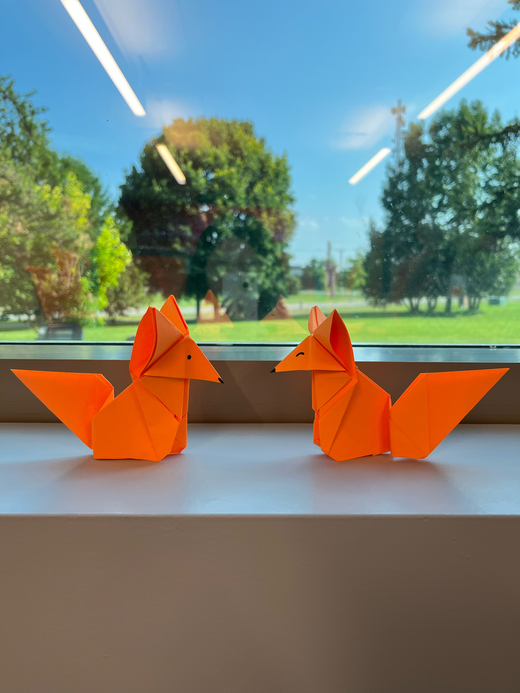
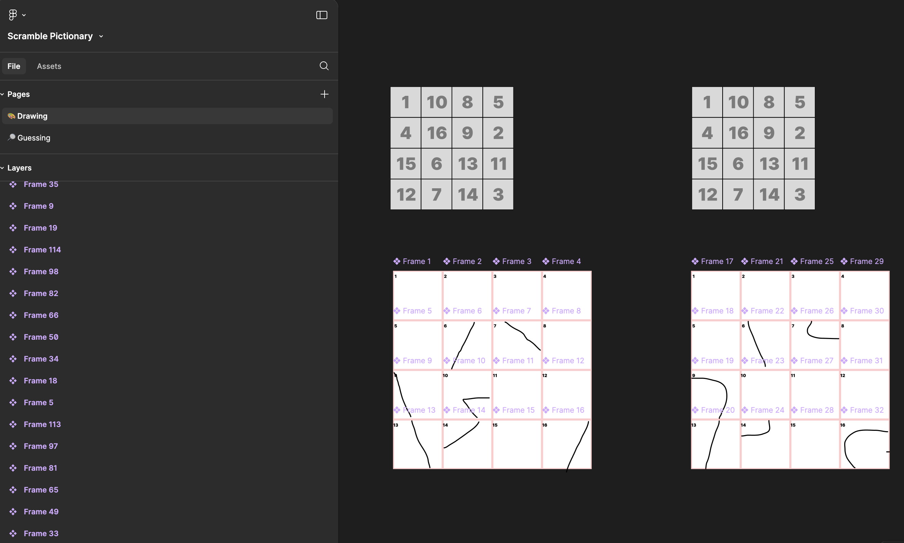
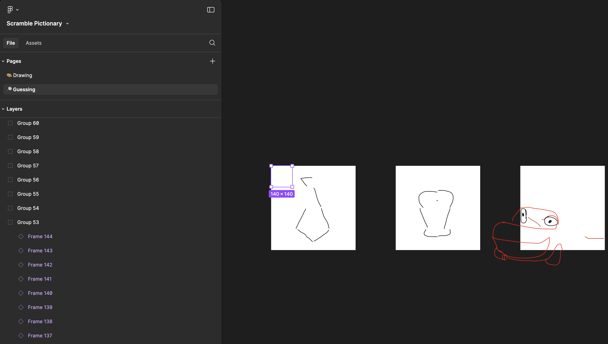

週會，team meeting，聽起來就是一個令人髮指的東西，但是在工作環境裡又避無可避。我以往經歷裡的週會大多枯燥無聊，不說沉悶，也往往是走個流程匯報相關事宜就草草了事，始終都是一種負擔。我在這個夏天的實習裡見證的週會卻不太一樣：他們叫它Mojo meeting，我第一次在「mojo dojo casa house」之外見到這個詞，一開始還在困惑它和barbie有什麼聯繫，後來才醒悟只是單純基於mojo的原本含義，**magic charm**。這是個大team，多達25個人（有5個以上的manager= =），一個一個輪流匯報工作是不現實的，反而是team leader負責準備notes，一個人講完所有他認為其他人都需要知曉的事項，通常用時在5至10分鐘之內，接下來半小時才是真正的mojo time。

根據一早安排的schedule，每週都會有一個人負責主持一個活動——沒有主題，沒有限制，準備所需要的時間和精力也任由你自己決定，偷懶有偷懶的做法，認真有認真的方式，它可以是任何形式。我見過獨角戲一樣的presentation介紹自己業餘掙錢的路數、戶外野營的經歷、關於3D或AI技術工具的使用；也見過你畫我猜、fake news or real news的trivia quiz和不正經的輕量級design competition；我們有時候一起做手工，有時候一起玩guessing game，有時候乾脆一起出去吃冰淇淋然後提前下班。如果必須要找到一個詞來形容這些活動的共性，我會覺得是「creativity for fun」。

眼見這段實習就快結束，我簡單整理了下過去幾個月我覺得最有意思的mojo activities。至於它們有什麼用呢，「有意思」還不夠有用嗎！
## Transliteration Challenge
抱著明顯的私心把我製作的這個Transliteration Challenge第一個端上來。眾所周知粵語裡有很多英語演變而來的音譯詞，有一天我就靈光乍現想考考這些老外聽粵語能不能分辨出它們的英文原詞，這就成為了我主持的mojo activity。

有這個想法容易，準備工作卻麻煩不少。光是選取合適的音譯詞和能造成迷惑性的其他選項就讓我想破了頭，也找了很久用哪個平台製作這個quiz以及哪裡下載對應的粵語音頻——有時候找遍互聯網都未果，我乾脆和對象每人錄了幾條音頻。除了multiple choices之外我還針對幾個發音比較明顯的詞語限定了畫圖作答的形式。結果發現幾乎每個人都能把「梳打」畫出來，我以為最簡單的「波」卻有不少人畫了蝴蝶結（bow），「巴士」這道題也有一些人畫成了basil，還蠻有趣的。

整體來看team裡所有參與者的平均正確率在60%-70%左右，得分最高的是組裡另一位亞裔，正確率達到了88%，但直到這個活動結束我才知道人家是菲律賓和中國混血。我們從來沒見過面，只看照片我一直以為她來自拉丁美洲= =。開心的是活動結束後收到了不少同事的積極反饋，說我帶來了一些更新鮮的idea讓他們覺得很好玩吧啦吧啦，我也很有成就感。

感興趣的朋友可以點擊這個[鏈接](https://quizizz.com/embed/quiz/6674ddb367238915f1b41817)或者在下方（好像只適配網頁端）簡單試玩，如果也想利用它來做多人活動可能就需要在quizizz上註冊帳號再在資源庫裡搜我發布的這個quiz了。

<iframe src="https://quizizz.com/embed/quiz/6674ddb367238915f1b41817" title="Transliteration Challenge - Quizizz" style="flex:1;" frameBorder="0" allowfullscreen></iframe>

## Mindfulness & Origami
說來也巧，我剛看完友鄰的這篇[冥想入門博客](https://thirdshire.com/meditation/)，那週的mojo activity主題就是mindfulness。我們互相分享了一些有益緩解壓力、提升精神狀態的日常習慣，有人提到冥想，有人提到擼貓，有人提到把slack通知關掉（笑），我提到了毛象上常見的「三件好事」（列舉當天最讓你感到快樂的三件事）。

主講人做了一個簡短的presentation，然後就介紹了Origami（摺紙）作為聚焦當下的一種媒介形式，還貼心地附上了好幾個教學視頻供大家參考。不管是onsite還是remote，大家就開始靜靜雞做手工，提前做完提前下班。我沒想到我挑的小狐狸還有點難度，為此還OT了十分鐘——但它值得。請看，我和另一個同事不約而同選中的狐狸姐妹！

## 物種起源猜詞遊戲
[metazooa](https://metazooa.com/)和[metaflora](https://flora.metazooa.com/)是兩個網頁猜詞遊戲，像wordle一樣每天都會更新一次當天唯一的答案。不同之處是它們的謎底是一種動物或植物，從所有具有細胞組織的動物（metazoa）和綠色植物（viridiplantae）的起源開始，玩家有20來次機會輸入單詞確認每次猜測的物種和謎底在生物分類學上的共通點，直到找到正確答案。我們有一天的mojo activity就是有人分享了這兩個網頁遊戲，全組人一起猜當天metazooa和metaflora的謎底。

因為生物分類學的歸類法全是生僻詞，我不得不每次都英翻中+維基確認各種界門綱目科都是什麼東西，但從概念來看我還是喜歡這兩個遊戲的，推薦給大家玩！
## 你畫我猜
你畫我猜，永不過時的團體遊戲。我們用的是[Gartic Phone](https://garticphone.com/)一起在線玩，但和以前我自己玩的版本稍有不同的是我們畫的對象不是簡單的一個詞，而是其他人瞎編的短語或句子，像「斯萊特林的迪斯科舞會」或是「在滑板上打籃球」，再一個個傳下去看最後畫成了個什麼鬼樣子。遊戲很簡單， 提議玩這個的人除了一個網址什麼都不用準備，但效果也是真的好，我記得這場mojo meeting是所有人笑得最多的一次，純粹的快樂！
## Scramble Pictionary 
在我看來是你畫我猜的創意變種。我們一位同事自己在一個Figma文件裡開了兩個page，一個用來畫，一個用來猜。畫畫那一頁的主角是由十六宮格組成的畫布，每一個格都有對應的1至16數字編號。每張畫布會匹配一個打亂編號的數字十六宮格，代表的是猜謎那一頁的畫布預覽顯示的方格順序。因為利用了Figma component的特性，負責畫畫的玩家在每一個component（組件）畫格裡畫出的內容會同步到猜謎頁的instance（實例）裡。至於畫什麼東西就由負責繪畫的人自己決定，或者在[word generator](https://www.thegamegal.com/word-generator/)上找靈感。

相比猜詞，這個遊戲最有體驗感的其實是畫手。因為繪畫的過程需要把所有線條重新拆解，根據方格的編號想象線條最終會出現的位置，再一筆一筆地嘗試連接各個格子，讓猜謎那一頁能顯示出相對合理的形狀。比如在下圖的第一個十六宮格裡，16、9、6、13是最中心的四格，畫手就要在畫布上找到對應數字編號的那幾格，想像它們作為畫面的中心如何排佈線條。這個遊戲基本上就是一個人畫，十幾個人圍著在另一頁猜，同時作畫的人不允許去另一頁看他正在畫的東西的實際顯示效果，直到有人猜對為止。

## GeoGuessr地理猜謎
查了一下資料發現[GeoGuessr](https://www.geoguessr.com/)其實已經火了好幾年了，而且有單人模式、在線競技甚至世界杯比賽好幾種玩法。這是一款基於Google Street街景圖像推理正確地點的網頁遊戲，玩家可以點擊方向箭頭四周探索，根據路牌、建築、行人、植物等等線索推測可能的地理位置，最後GeoGuessr會比較你的答案和正確地點的直線距離來進行打分。

我剛入職那會兒Max剛好在歐洲上線，一個同事就藉著這個由頭在mojo meeting帶來了這個遊戲。一群人一起比拼誰猜的地點更近，誰猜的又十萬八千里不搭邊，我還蠻喜歡玩的！記得最簡單的一個謎底是西雅圖的口香糖牆，因為太過於標誌性，大部分人都知道這個地方，就要拼命放大地圖找最精確的位置，和答案距離相差150米以內都是滿分，我們誕生了好幾個滿分lol。
## Just draw or design
身在design team，即興發揮的draw或design也是常見的活動主題。我參加的第一個mojo meeting就是drawing practice，主講人先解釋自己帶來的規則：第一個環節是30秒挑戰，每人在白紙上畫4個卡通形象，每個都必須在30秒之內完成；第二個環節是自畫像挑戰，每人在10分鐘、2分鐘和30秒的限時內各畫一次自畫像（或者別人），最後一起分享在群組裡。作為一個繪畫天份為零的人我當時猝不及防，沒有畫成什麼能拿得出手的東西。但觀察別人提交的成果，那些畫作的細節程度如何因應限時的區別而有所變化，還是挺有意思的。

還有一次mojo meeting的主題是Bumper Stickers Design，所有人一起在一個Figma文件裡展示自己半小時裡通過各種途徑設計的成果，再互相打心心reaction評出大家最喜歡的一個設計——會真正被打印出來用。好笑的是最後勝出的版本完全是極簡風格，靠字取勝：I'm speeding because I have to poop。

離實習結束還有兩週，說明還有兩次mojo meetings。理智告訴我應該再等兩週再發這篇博客，說不定還有什麼好玩的能加呢——但我沒有理智，我等不及想把這些好玩的東西先發出來，到時候有啥再補充吧！